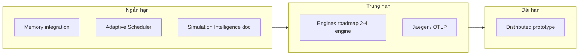

# Kế hoạch hệ thống tiếp theo — WorldOS

Dựa trên [backend/docs/WORLDOS_ARCHITECTURE_MAPPING.md](backend/docs/WORLDOS_ARCHITECTURE_MAPPING.md) (§28 Thiếu, §24/§37 Một phần) và [docs/RÀ_SOÁT_TMP.md](docs/RÀ_SOÁT_TMP.md).

---

## Hiện trạng

| §   | Thành phần                    | Trạng thái   | Ghi chú                                                                                                                                                |
| --- | ----------------------------- | ------------ | ------------------------------------------------------------------------------------------------------------------------------------------------------ |
| 28  | Distributed Simulation        | **Thiếu**    | Design doc có; shards, ghost zones, worker cluster chưa                                                                                                |
| 24  | Memory Layout & Performance   | **Một phần** | ZoneActorIndex + SocialGraphCsr có trong [engine/worldos-core/src/memory.rs](engine/worldos-core/src/memory.rs), **chưa tích hợp** vào advance/cascade |
| 37  | 80+ Engines                   | **Một phần** | Roadmap có; nhiều engine "Chưa" trong [backend/docs/WORLDOS_80_ENGINES_ROADMAP.md](backend/docs/WORLDOS_80_ENGINES_ROADMAP.md)                         |
| —   | Adaptive Scheduler            | Chưa         | Tick/engine frequency cố định; chưa điều chỉnh theo state (vd. war_activity)                                                                           |
| —   | Simulation Intelligence Layer | Chưa         | Causality, Emergence, Scenario có rời rạc; chưa doc/refactor gom tầng                                                                                  |
| 31  | Jaeger                        | **Một phần** | Span + cache khi tracing_enabled; chưa exporter đầy đủ / dashboard                                                                                     |

---

## Phân kỳ đề xuất

---

## 1. Ngắn hạn (ít rủi ro, cải thiện rõ)

### 1.1 Tích hợp Memory §24 vào Rust advance

- **Mục tiêu:** Dùng `ZoneActorIndex` và (tùy chọn) `SocialGraphCsr` trong kernel thay vì chỉ export struct.
- **Vị trí:** [engine/worldos-core](engine/worldos-core) — `universe.rs`, `cascade.rs` hoặc nơi advance đọc zone/agent.
- **Công việc:**
  - Đưa `ZoneActorIndex` vào `UniverseState` (hoặc struct state truyền vào advance); build/rebuild index từ `zone.agent_ids` khi load state hoặc sau khi spawn/move.
  - Trong bước zone update / diffusion, truy vấn "actors in zone" qua `ZoneActorIndex::actors_in_zone(zone_index)` thay vì scan toàn bộ agents.
  - `SocialGraphCsr`: tùy chọn — nếu Laravel đã gửi `state_vector.social_graph`, thêm field vào state Rust và dùng khi cần (vd. idea diffusion, loyalty). Có thể phase sau.
- **Kết quả:** §24 chuyển từ **Một phần** sang **Có** (khi index/CSR thực sự dùng trong loop).

### 1.2 Adaptive Scheduler (tick / engine frequency theo state)

- **Mục tiêu:** Engine frequency hoặc tick interval thay đổi theo tín hiệu (vd. `war_activity` cao → WarEngine chạy mỗi tick hoặc interval ngắn hơn).
- **Vị trí:** [backend/app/Simulation](backend/app/Simulation) — `SimulationScheduler`, `EngineRegistry`, config `worldos.php` (pipeline / tick).
- **Công việc:**
  - Định nghĩa "activity signals" từ state (vd. aggregate `war_stage`, `chaos_level`, `entropy`) — có thể từ snapshot hoặc cache.
  - SimulationScheduler (hoặc TickScheduler) đọc signals và chọn `stageOrder` / interval động cho vài engine (vd. War, Chaos).
  - Config: bật/tắt adaptive (feature flag), bảng mapping signal → interval (hoặc giữ mặc định khi tắt).
- **Tài liệu:** Cập nhật [docs/RÀ_SOÁT_TMP.md](docs/RÀ_SOÁT_TMP.md) mục 5 "Adaptive Scheduler" — Đã làm.

### 1.3 Simulation Intelligence Layer — doc + ranh giới

- **Mục tiêu:** Mô tả rõ tầng "Intelligence" (Causality, Emergence, Scenario, pattern detection) để dễ mở rộng, không bắt buộc refactor code lớn.
- **Vị trí:** Doc mới `backend/docs/SIMULATION_INTELLIGENCE_LAYER.md` (hoặc section trong WORLDOS_ARCHITECTURE).
- **Nội dung:** Liệt kê thành phần hiện có (RedisCausalityGraphService, AttractorEngine/emergence_events, scenario/benchmark), luồng dữ liệu (event → causality, state → emergence), và hướng mở rộng (Memetic Evolution, Civilization Mind). Cập nhật RÀ_SOÁT_TMP mục 9 — Đã doc.

---

## 2. Trung hạn (tính năng / vận hành)

### 2.1 Bổ sung 2–4 engine theo roadmap §37

- **Nguồn:** [backend/docs/WORLDOS_80_ENGINES_ROADMAP.md](backend/docs/WORLDOS_80_ENGINES_ROADMAP.md) — các ô "Chưa" / "Roadmap".
- **Ưu tiên gợi ý:** Ocean/Hydrology (Layer 1), Education/Media (Layer 4), hoặc Diplomacy/Empire (Layer 7) tùy product.
- **Công việc:** Mỗi engine: đăng ký trong EngineRegistry, implement interface, hook vào pipeline stage phù hợp, cập nhật roadmap trạng thái **Có** / **Một phần**.

### 2.2 Observability đầy đủ — Jaeger / OpenTelemetry

- **Mục tiêu:** Trace từ Laravel → Rust (và giữa stages) xuất ra Jaeger hoặc OTLP collector.
- **Vị trí:** Backend — `SimulationTracer`, config tracing; có thể dùng OpenTelemetry PHP + OTLP exporter.
- **Công việc:** Cấu hình exporter (Jaeger/OTLP endpoint), đảm bảo span bám đủ advance → stages → engine; tùy chọn Grafana dashboard cho `tick_duration_ms`, `engine_execution_time_seconds`, `event_rate` (đã có Prometheus).

---

## 3. Dài hạn (scale)

### 3.1 Distributed Simulation §28 — prototype

- **Tham chiếu:** [backend/docs/DISTRIBUTED_SIMULATION_ARCHITECTURE.md](backend/docs/DISTRIBUTED_SIMULATION_ARCHITECTURE.md).
- **Mục tiêu:** Bản prototype tối thiểu — 2–4 shards, 1 Scheduler Node + 2 Worker Node (có thể cùng host), ghost zones ở dạng đơn giản (sync neighbor state qua message).
- **Công việc chính:**
  - Shard assignment: `zone_id % num_shards`; Laravel (hoặc Scheduler Node) gửi advance request theo shard.
  - Worker: service/process nhận advance cho một shard, đọc state (từ Redis/DB), chạy advance, ghi snapshot + gửi cross-shard events (Redis pub/sub hoặc Kafka).
  - Ghost zones: worker A giữ bản sao read-only zones biên của shard B; cập nhật qua event hoặc periodic sync.
  - Không bắt buộc NATS ngay; Redis/Kafka đủ cho prototype.
- **Kết quả:** §28 chuyển từ **Thiếu** sang **Một phần** (prototype chạy được 1 universe với 2–4 shards).

---

## Thứ tự thực hiện gợi ý

1. **1.3** (Simulation Intelligence doc) — nhanh, không đụng code.
2. **1.1** (Memory integration) — cải thiện §24, nền cho scale.
3. **1.2** (Adaptive Scheduler) — cải thiện trải nghiệm simulation theo ngữ cảnh.
4. **2.2** (Jaeger/OTLP) — nếu ưu tiên vận hành.
5. **2.1** (2–4 engine) — theo nhu cầu product.
6. **3.1** (Distributed prototype) — khi cần scale "nhiều universe song song".

---

## Cập nhật tài liệu sau khi làm

- [backend/docs/WORLDOS_ARCHITECTURE_MAPPING.md](backend/docs/WORLDOS_ARCHITECTURE_MAPPING.md): cập nhật §24, §28, §37 (và §31 nếu Jaeger xong) trong bảng đánh giá và phần Tóm tắt ưu tiên.
- [docs/RÀ_SOÁT_TMP.md](docs/RÀ_SOÁT_TMP.md): đánh dấu đã làm cho các mục tương ứng (Adaptive Scheduler, Simulation Intelligence Layer, Jaeger nếu hoàn thành).

