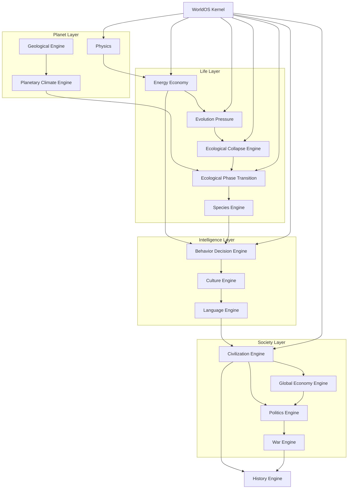

# WorldOS Full Engine Roadmap

## Hiện trạng đã có (trong codebase)

| Thành phần                            | Trạng thái | Ghi chú                                                                                                                                                                                                     |
| ------------------------------------- | ---------- | ----------------------------------------------------------------------------------------------------------------------------------------------------------------------------------------------------------- |
| Energy Economy                        | Có         | [ProcessActorEnergyAction](backend/app/Modules/Intelligence/Actions/ProcessActorEnergyAction.php): metabolism, gather, starvation, reproduction, mutation                                                   |
| Evolution Pressure                    | Có         | [EvolutionPressureService](backend/app/Modules/Intelligence/Services/EvolutionPressureService.php): pressure từ zone, fitness, species_id                                                                   |
| ActorBio / mortality                  | Có         | life_expectancy từ genome, mortality curve trong [ActorTransitionSystem](backend/app/Modules/Intelligence/Services/ActorTransitionSystem.php)                                                               |
| Evolution shock (nhẹ)                 | Có         | `state_vector['evolution_shock']` trong EvolutionPressureService                                                                                                                                            |
| Civilization Collapse (institutional) | Có         | [CivilizationCollapseEngine](backend/app/Services/Simulation/CivilizationCollapseEngine.php): entropy vs stability, institutions fragment, attractors — **không** phải ecological (species/population/food) |
| Zones / state_vector                  | Có         | zones với state (food/resources, population_proxy), field diffusion                                                                                                                                         |
| Biology metrics API                   | Có         | [BiologyMetricsService](backend/app/Modules/Intelligence/Services/BiologyMetricsService.php), dashboard panel                                                                                               |

**Chưa có:** Ecological Collapse (biodiversity, resource_stress, predator_ratio, famine cascade), Phase Transition (biome shift), Simulation Kernel (scheduler, event bus), Behavior/Decision, Culture, Language, Civilization (settlement/trade), Global Economy, Politics, War, History.

---

## Sơ đồ phụ thuộc (pipeline)

---

## Thứ tự triển khai đề xuất

### Tier 0 — Đã có (chỉ mở rộng nếu cần)

- Energy Economy, Evolution Pressure, ActorBio, speciation, biology metrics, evolution_shock.
- Civilization Collapse (institutional): giữ nguyên; Ecological Collapse sẽ bổ sung lớp **sinh thái** bên dưới.

### Tier 1 — Ecological Collapse Engine (bước tiếp theo hợp lý)

- **Phụ thuộc:** Energy Economy, Evolution Pressure, zones, actors với energy/species_id.
- **Nội dung:** Đo ecosystem metrics (total_population, species_count, resource_level, predator_ratio, biodiversity_index), tính instability_score, khi vượt ngưỡng → trigger collapse event (famine / disease / predator_crash). Collapse phase: giảm resource_regen, tăng death_prob, giảm reproduction; recovery phase sau N ticks. Lưu CollapseEvent (tick, cause, population_loss) cho narrative.
- **Tích hợp:** Gọi mỗi evolution_tick (hoặc mỗi N tick); có thể ghi `state_vector['evolution_shock']` hoặc event riêng để EvolutionPressureService và narrative dùng.

### Tier 2 — Ecological Phase Transition Engine

- **Phụ thuộc:** Ecological Collapse (hoặc ít nhất ecosystem metrics), môi trường theo vùng (zone/cell).
- **Nội dung:** EnvironmentState (temperature, rainfall, vegetation_density…) và EcosystemState (forest, grassland, desert…). Critical threshold: khi biến vượt ngưỡng → chuyển pha (forest → grassland → desert). Transition dần (progress 0→1), ảnh hưởng resource_regeneration và species affinity. Ghi PhaseTransitionEvent (tick, from_state, to_state, affected_area).
- **Lưu ý:** Cần mô hình zone có temperature/rainfall hoặc proxy (ví dụ từ climate engine hoặc từ zone config).

### Tier 3 — WorldOS Simulation Kernel (tùy chọn sớm)

- **Phụ thuộc:** Không bắt buộc engine nào; có thể wrap các engine hiện có.
- **Nội dung:** Simulation Clock (tick, time_scale), Engine Scheduler (tick_rate per engine: physics=1, ecology=10, evolution=100, climate=500…), World State Store (terrain, climate, actors, species, resources), Event Bus (ActorDied, SpeciesExtinct, CollapseTriggered…), Metrics System, Persistence (snapshot / event log). Engine interface chung: tick_rate(), update(ctx).
- **Lợi ích:** Tránh deadlock logic, dễ thêm engine mới, chuẩn bị multi-thread / distributed sau này.

### Tier 4 — Planetary Climate Engine (nếu muốn phase transition có nền)

- **Phụ thuộc:** Có thể chạy độc lập hoặc sau Kernel.
- **Nội dung:** Solar input, latitude climate zones, nhiệt độ/mưa đơn giản, seasonal cycle, ice coverage (albedo feedback). Output: temperature/rainfall per zone → dùng cho Phase Transition và biome. Có thể chạy rất chậm (climate_tick = 500+).

### Tier 5 — Geological Engine (tùy chọn, scale rất dài)

- **Phụ thuộc:** Planet surface model (grid cells).
- **Nội dung:** Tectonic plates, elevation, volcano, erosion, river, mineral distribution. Chạy cực chậm (geology_tick = 5000+). Cung cấp terrain cho Climate và Civilization.

### Tier 6 — Behavior & Decision Engine

- **Phụ thuộc:** Actors (physiology, genome), Perception (vision, memory), spatial query (zone/cell hoặc spatial index).
- **Nội dung:** Needs (hunger, safety, reproduction, social), goal từ needs, Utility AI (score action: eat, flee, mate, explore), execution state (idle, moving, eating…), memory decay. Personality từ behavior_vector (aggression, curiosity, cooperation, fear). Có thể stagger tick (actor_id % N) để tối ưu.

### Tier 7 — Culture Engine

- **Phụ thuộc:** Behavior Engine (decision đọc culture), actors, groups.
- **Nội dung:** Meme pool (survival, social, technology, ritual), transmission (parent–child, peer, observation), cultural selection (fitness), mutation/drift. Culture groups (shared memes → cohesion). Feedback vào behavior: culture_weight trong decision_score.

### Tier 8 — Language Engine

- **Phụ thuộc:** Culture Engine, actors có memory và communication.
- **Nội dung:** Signals → symbols → words → proto-grammar. Communication flow: intent → encode → decode → memory. Vocabulary growth, semantic network, language groups. Có thể dùng LLM cho một số actor quan trọng (encode/decode intent).

### Tier 9 — Civilization Engine (settlement layer)

- **Phụ thuộc:** Behavior, Culture, Language (hoặc tối thiểu population density + resource surplus).
- **Nội dung:** Settlement formation (camp → village → town → city theo population), population roles (hunter, farmer, builder, leader…), resource economy (production, storage, consumption), infrastructure, governance (tribal → chiefdom → kingdom), law, trade routes, technology tree, migration. Lifecycle: emergence → growth → peak → decline → collapse (có thể gắn với CivilizationCollapseEngine và Ecological Collapse).

### Tier 10 — Global Economy Engine

- **Phụ thuộc:** Civilization (settlements, production, trade).
- **Nội dung:** Resource types, production equation, specialization, market per settlement, price discovery (demand/supply), trade network, transport cost, currency, wealth distribution, taxation, investment, boom/bust và economic crisis.

### Tier 11 — Politics Engine

- **Phụ thuộc:** Civilization, Economy.
- **Nội dung:** Power (military, economic, influence, authority), factions, legitimacy, governance types, policy, corruption, stability, conflict/coup/revolution, diplomacy. Ghi political events cho History.

### Tier 12 — War Engine

- **Phụ thuộc:** Civilization, Politics (hoặc ít nhất settlements + military power).
- **Nội dung:** Casus belli (resource, territory, culture), battle power, territory change, population loss, plunder. Có thể tích hợp với institutional conflict hiện có.

### Tier 13 — History Engine

- **Phụ thuộc:** Toàn bộ event từ Collapse, Phase Transition, Civilization, Economy, Politics, War.
- **Nội dung:** Timeline của planet: collapse events, phase transitions, settlements, wars, revolutions. API/dashboard: population timeline, biodiversity, extinction graph, civilization rise/fall. Chronicle đã có — History Engine chuẩn hóa và aggregate events thành “lịch sử” query được.

---

## Bảng tóm tắt thứ tự và phụ thuộc

| Tier | Engine                      | Phụ thuộc chính                  | Deliverable chính                                                                      |
| ---- | --------------------------- | -------------------------------- | -------------------------------------------------------------------------------------- |
| 1    | Ecological Collapse         | Energy, Evolution, zones, actors | Instability detection, collapse trigger, recovery, CollapseEvent log                   |
| 2    | Ecological Phase Transition | Ecosystem metrics, zone env      | EnvironmentState, EcosystemState, threshold, transition progress, PhaseTransitionEvent |
| 3    | Simulation Kernel           | (none)                           | Clock, Scheduler, EventBus, WorldState stores, engine interface                        |
| 4    | Planetary Climate           | (optional) Kernel                | Temperature/rainfall per zone, seasons, ice                                            |
| 5    | Geological                  | Grid/terrain                     | Plates, elevation, volcano, erosion (rất chậm)                                         |
| 6    | Behavior & Decision         | Actors, spatial                  | Needs, goals, Utility AI, action execution, memory                                     |
| 7    | Culture                     | Behavior                         | Memes, transmission, selection, culture groups                                         |
| 8    | Language                    | Culture                          | Signals, symbols, words, grammar, communication                                        |
| 9    | Civilization                | Behavior, Culture, Language      | Settlements, roles, economy, governance, trade, tech                                   |
| 10   | Global Economy              | Civilization                     | Markets, prices, trade network, currency, crises                                       |
| 11   | Politics                    | Civilization, Economy            | Power, factions, legitimacy, revolution                                                |
| 12   | War                         | Civilization, Politics           | Battles, territory, plunder                                                            |
| 13   | History                     | All events                       | Timeline API, aggregation, narrative hooks                                             |

---

## Gợi ý triển khai ngắn hạn

1. **Ecological Collapse Engine (Tier 1)**
  Tận dụng actors, zones, BiologyMetricsService; thêm service đo instability (biodiversity_index, resource_stress, predator_ratio), ngưỡng collapse, và phase collapse/recovery; ghi event để Chronicle/Narrative dùng. Không chỉnh CivilizationCollapseEngine (institutional) — hai thứ bổ sung cho nhau.
2. **Kernel (Tier 3)**
  Có thể làm sớm để mọi engine chạy qua Scheduler + Event Bus, tránh gọi trực tiếp giữa các engine và chuẩn bị scale.
3. **Behavior (Tier 6)**
  Là bước nhảy từ “actor bị ecosystem đẩy” sang “actor có hành vi chủ động”; cần nhất cho narrative và civilization sau này.

Sau khi bạn chốt triển khai engine cụ thể (ví dụ chỉ Ecological Collapse, hoặc Collapse + Kernel), có thể lập kế hoạch chi tiết từng bước (file, config, API, dashboard) cho engine đó mà không chỉnh toàn bộ roadmap này.