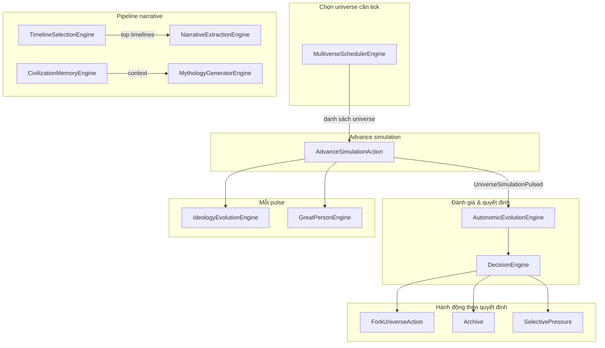

# WorldOS: Các module Engine và mối quan hệ

Tài liệu tổng hợp các engine chức năng trong WorldOS và cách chúng liên kết với nhau.

---

## 1. Sơ đồ quan hệ tổng quan

---

## 2. Các Engine theo nhóm chức năng

### 2.1. Lớp điều phối (Scheduling & đánh giá)

| Engine | Vai trò | Quan hệ |
|--------|--------|--------|
| **MultiverseSchedulerEngine** | Chọn universe nào được tick trong mỗi chu kỳ. Ưu tiên theo điểm novelty, complexity, civilization, entropy. Dùng `tick_budget` (config) để giới hạn số universe tick mỗi world. | Đầu vào: World. Đầu ra: Collection universe → đưa vào AutonomicWorkerService / AutonomicPulseAction để dispatch advance. |
| **AutonomicEvolutionEngine (AEE)** | Đánh giá snapshot universe (entropy, stability, novelty) và đưa ra quyết định: **fork**, **archive**, **mutate**, **continue**. Implement `UniverseEvaluatorInterface`. | Được DecisionEngine gọi; đầu ra recommendation → ForkUniverseAction, archive, hoặc applySelectivePressure. |
| **DecisionEngine** | Kết hợp AEE + “navigator score” (novelty, complexity, divergence). Có thể ghi đè recommendation (ví dụ ép fork khi score cao, ép archive khi catastrophe). | Gọi AEE, tính navigator score, trả về action cuối cùng cho listener EvaluateSimulationResult. |

### 2.2. Fork & nhánh

| Thành phần | Vai trò | Quan hệ |
|------------|--------|--------|
| **ForkUniverseAction** | Thực hiện fork: tạo 1 hoặc N child universe từ parent, ghi BranchEvent, idempotent theo (universe_id, from_tick). | Được EvaluateSimulationResult gọi khi action = fork. Gọi SagaService::spawnUniverse (có thể N lần nếu multi-branch). |
| **SagaService** | ensureSaga(Universe), spawnUniverse(World, parentId, sagaId, payload). Tạo universe mới, kế thừa state, mutation, seed. | ForkUniverseAction gọi spawnUniverse; listener gọi ensureSaga trước khi fork. |

### 2.3. Pipeline narrative (timeline → story/lore)

| Engine | Vai trò | Quan hệ |
|--------|--------|--------|
| **TimelineSelectionEngine** | Chọn “timeline hay nhất” theo điểm narrative (novelty, complexity, divergence, depth, tension). Trả về top-N universe cho World hoặc Saga. | Đầu vào: World/Saga, limit. Đầu ra: Collection Universe → dùng cho extract-lore hoặc hiển thị. |
| **NarrativeExtractionEngine** | Biến timeline thành story/lore: gọi TimelineSelectionEngine để lấy universe, rồi với mỗi universe gọi NarrativeAiService::generateChronicle(..., type lore). | Dùng TimelineSelectionEngine + NarrativeAiService; có thể gọi extractBestFromWorld/Saga. |
| **CivilizationMemoryEngine** | Tổng hợp “ký ức văn minh” cho một universe trong khoảng tick: key_events (BranchEvent + Chronicle), branch_events, chronicles, collapse_hints. | Đầu vào: Universe, from_tick, to_tick. Đầu ra: array cấu trúc → dùng cho narrative, mythology, hoặc API. |
| **MythologyGeneratorEngine** | Sinh chronicle dạng thần thoại (type `myth`) cho universe trong khoảng tick. Gọi NarrativeAiService::generateChronicle(..., type myth). | Có thể dùng CivilizationMemoryEngine (getMemoryForUniverse) cho context; đầu ra Chronicle. |

### 2.4. Chạy mỗi pulse (sau advance)

| Engine | Vai trò | Quan hệ |
|--------|--------|--------|
| **IdeologyEvolutionEngine** | Gộp ideology_vector từ các institution còn active → “dominant ideology”, ghi vào universe.state_vector; khi chênh lệch đủ lớn so với lần trước thì tạo Chronicle type ideology_shift. | Được EvaluateSimulationResult gọi mỗi pulse (nếu config worldos.pulse.run_ideology bật). Đọc InstitutionalEntity. |
| **GreatPersonEngine** | Kiểm tra điều kiện (entropy trong khoảng, đủ institution, cooldown từ lần supreme_emergence cuối); nếu đủ thì gọi SpawnSupremeEntityAction để tạo “vĩ nhân”. | Được EvaluateSimulationResult gọi mỗi pulse (nếu config worldos.pulse.run_great_person bật). Dùng BranchEvent để kiểm tra cooldown. |

### 2.5. Các engine khác trong Simulation module

| Engine / Service | Vai trò ngắn gọn |
|------------------|-------------------|
| **WorldRegulatorEngine** | Điều chỉnh cấp world (axiom, genre, …) sau mỗi pulse. |
| **ConvergenceEngine** | Xử lý hội tụ / áp lực theo tick. |
| **ResonanceEngine** | Xử lý cộng hưởng giữa các universe/entity. |
| **CausalCorrectionEngine** | Hiệu chỉnh nhân quả (ví dụ SupremeEntity, trajectory). |
| **PressureCalculator** | Tính áp lực chọn lọc từ snapshot/state. |
| **ScenarioEngine** | Danh sách scenario có thể launch cho universe. |
| **MultiverseInteractionService** | Phát hiện tương tác/cộng hưởng giữa các universe. |
| **VoidExplorationEngine** | Xử lý “không gian trống” / biên. |
| **EpochEngine** | Xử lý epoch (kỷ nguyên) của universe. |
| **ObservationInterferenceEngine** | Ảnh hưởng của quan sát lên simulation. |
| **TrajectoryModelingEngine** | Mô hình hóa quỹ đạo / trajectory. |
| **AutonomicWorkerService** | Điều phối: lấy danh sách world autonomic, gọi Scheduler, dispatch AdvanceUniverseJob. |

---

## 3. Luồng dữ liệu chính

1. **Chu kỳ pulse (autonomic)**  
   `worldos:autonomic-pulse` hoặc `worldos:pulse` → AutonomicWorkerService / AutonomicPulseAction dùng **MultiverseSchedulerEngine** để lấy danh sách universe cần tick → advance từng universe → event **UniverseSimulationPulsed** → **EvaluateSimulationResult** gọi **DecisionEngine** (và AEE) → Fork / Archive / Mutate / Continue; đồng thời gọi **IdeologyEvolutionEngine**, **GreatPersonEngine** (nếu bật config).

2. **Từ timeline đến lore**  
   **TimelineSelectionEngine** chọn top timeline (theo World/Saga) → **NarrativeExtractionEngine** extract lore (Chronicle type lore) cho từng universe. **CivilizationMemoryEngine** có thể dùng độc lập (API/CLI) hoặc làm context cho **MythologyGeneratorEngine**.

3. **Fork**  
   AEE + DecisionEngine quyết định `fork` → **ForkUniverseAction** (idempotent, có thể multi-branch) → **SagaService::spawnUniverse** (N lần nếu N > 1) → parent chuyển halted khi đã tạo ít nhất 1 child.

---

## 4. Config và điểm gắn kết

- **worldos.autonomic**: fork_entropy_min, archive_entropy_threshold, stagnation_threshold, max_fork_branches → AEE, ForkUniverseAction.
- **worldos.scheduler**: tick_budget, priority_weights → MultiverseSchedulerEngine.
- **worldos.timeline_selection**: default_limit, narrative_weights → TimelineSelectionEngine.
- **worldos.narrative_extraction**: default_limit, chronicle_type → NarrativeExtractionEngine.
- **worldos.civilization_memory**: max_events, max_chronicles → CivilizationMemoryEngine.
- **worldos.mythology_generator**: chronicle_type → MythologyGeneratorEngine.
- **worldos.ideology_evolution**: store_in_state_vector → IdeologyEvolutionEngine.
- **worldos.great_person**: entropy_min/max, min_institutions, cooldown_ticks → GreatPersonEngine.
- **worldos.pulse**: run_ideology, run_great_person → EvaluateSimulationResult (gọi Ideology, Great Person mỗi pulse).

CLI: `php artisan worldos:engines {action}`. API: prefix `worldos` (worlds/sagas/universes + timelines, extract-lore, civilization-memory, mythology, ideology, great-person, engines/status). Chi tiết xem [WORLDOS_COMMANDS_AND_API.md](WORLDOS_COMMANDS_AND_API.md).
