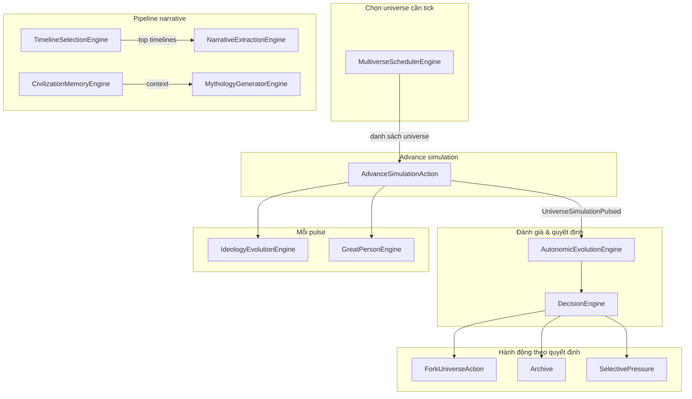

# WorldOS: Các module Engine và mối quan hệ

Tài liệu tổng hợp các engine chức năng trong WorldOS và cách chúng liên kết với nhau.

**Tham chiếu kiến trúc:** [WorldOS Kiến Trúc Toàn Diện](../../docs/WORLDOS_ARCHITECTURE.md) (doc thiết kế 38 mục). **So khớp với code:** [WORLDOS_ARCHITECTURE_MAPPING.md](WORLDOS_ARCHITECTURE_MAPPING.md) (engine/service đã có vs còn thiếu).

---

## 1. Sơ đồ quan hệ tổng quan

---

## 2. Các Engine theo nhóm chức năng

### 2.1. Lớp điều phối (Scheduling & đánh giá)

| Engine | Vai trò | Quan hệ |
|--------|--------|--------|
| **MultiverseSchedulerEngine** | Chọn universe nào được tick trong mỗi chu kỳ. Ưu tiên theo điểm novelty, complexity, civilization, entropy. Dùng `tick_budget` (config) để giới hạn số universe tick mỗi world. | Đầu vào: World. Đầu ra: Collection universe → đưa vào AutonomicWorkerService / AutonomicPulseAction để dispatch advance. |
| **AutonomicEvolutionEngine (AEE)** | Đánh giá snapshot universe (entropy, stability, novelty) và đưa ra quyết định: **fork**, **archive**, **mutate**, **continue**. Implement `UniverseEvaluatorInterface`. | Được DecisionEngine gọi; đầu ra recommendation → ForkUniverseAction, archive, hoặc applySelectivePressure. |
| **DecisionEngine** | Kết hợp AEE + “navigator score” (novelty, complexity, divergence). Có thể ghi đè recommendation (ví dụ ép fork khi score cao, ép archive khi catastrophe). | Gọi AEE, tính navigator score, trả về action cuối cùng cho listener EvaluateSimulationResult. |

### 2.2. Fork & nhánh

| Thành phần | Vai trò | Quan hệ |
|------------|--------|--------|
| **ForkUniverseAction** | Thực hiện fork: tạo 1 hoặc N child universe từ parent, ghi BranchEvent, idempotent theo (universe_id, from_tick). | Được EvaluateSimulationResult gọi khi action = fork. Gọi SagaService::spawnUniverse (có thể N lần nếu multi-branch). |
| **SagaService** | ensureSaga(Universe), spawnUniverse(World, parentId, sagaId, payload). Tạo universe mới, kế thừa state, mutation, seed. | ForkUniverseAction gọi spawnUniverse; listener gọi ensureSaga trước khi fork. |

### 2.3. Pipeline narrative (timeline → story/lore)

| Engine | Vai trò | Quan hệ |
|--------|--------|--------|
| **TimelineSelectionEngine** | Chọn “timeline hay nhất” theo điểm narrative (novelty, complexity, divergence, depth, tension). Trả về top-N universe cho World hoặc Saga. | Đầu vào: World/Saga, limit. Đầu ra: Collection Universe → dùng cho extract-lore hoặc hiển thị. |
| **NarrativeExtractionEngine** | Biến timeline thành story/lore: gọi TimelineSelectionEngine để lấy universe, rồi với mỗi universe gọi NarrativeAiService::generateChronicle(..., type lore). | Dùng TimelineSelectionEngine + NarrativeAiService; có thể gọi extractBestFromWorld/Saga. |
| **CivilizationMemoryEngine** | Tổng hợp “ký ức văn minh” cho một universe trong khoảng tick: key_events (BranchEvent + Chronicle), branch_events, chronicles, collapse_hints. | Đầu vào: Universe, from_tick, to_tick. Đầu ra: array cấu trúc → dùng cho narrative, mythology, hoặc API. |
| **MythologyGeneratorEngine** | Sinh chronicle dạng thần thoại (type `myth`) cho universe trong khoảng tick. Gọi NarrativeAiService::generateChronicle(..., type myth). | Có thể dùng CivilizationMemoryEngine (getMemoryForUniverse) cho context; đầu ra Chronicle. |

### 2.4. Chạy mỗi pulse (sau advance)

| Engine | Vai trò | Quan hệ |
|--------|--------|--------|
| **Supreme Entity (natural emergence)** | Guards, complexity từ population, công thức P (World Will / Outer God). Population từ EcosystemMetricsService khi chưa có trong metrics. | ProcessInstitutionalFramework → SupremeEntityEvolutionService; Eval ghi cosmic_phase vào metrics. |
| **Cosmic Phase detector** | Dominant axis (faith/chaos/order/tech) + hysteresis; ghi `snapshot.metrics['cosmic_phase']`. | EvaluateSimulationResult::storePressureMetrics. |
| **IdeologyEvolutionEngine** | Gộp ideology_vector từ các institution còn active → “dominant ideology”, ghi vào universe.state_vector; khi chênh lệch đủ lớn so với lần trước thì tạo Chronicle type ideology_shift. | Được EvaluateSimulationResult gọi mỗi pulse (nếu config worldos.pulse.run_ideology bật). Đọc InstitutionalEntity. |
| **GreatPersonEngine** | Kiểm tra điều kiện (entropy trong khoảng, đủ institution, cooldown từ lần supreme_emergence cuối); nếu đủ thì gọi SpawnSupremeEntityAction để tạo “vĩ nhân”. | Được EvaluateSimulationResult gọi mỗi pulse (nếu config worldos.pulse.run_great_person bật). Dùng BranchEvent để kiểm tra cooldown. |

### 2.5. Power Economy & Market

| Engine / Service | Vai trò | Quan hệ |
|------------------|--------|--------|
| **CosmicEnergyPoolService** | Pool năng lượng vũ trụ cấp universe: đọc `snapshot.metrics` (cosmic_phase, energy_level) và Supreme Entity active; tính inflow/decay/cap; ghi `state_vector.cosmic_energy_pool`. Tùy chọn feed_zones chuyển một phần pool sang `zones[i].state.free_energy`. | Gọi mỗi pulse trong EvaluateSimulationResult (sau storePressureMetrics). Config: `worldos.power_economy`. |
| **GlobalEconomyEngine** | Tier 10: đọc settlements từ state_vector, tính surplus/consumption theo zone; ghi `state_vector.civilization.economy` (total_surplus, total_consumption, **trade_flow**, **hub_scores** — Doc §16). | Chạy trong EconomyStage (tick pipeline) theo `worldos.intelligence.economy_tick_interval`. Config: `worldos.economy` (trade_route_capacity_factor, hub_connectivity_factor). |
| **MarketEngine** | Tính giá food từ surplus/consumption, ghi `state_vector.economy.market` (prices, updated_tick, volatility); phát event MARKET_CRASH, ECONOMIC_BOOM, TRADE_ROUTE_ESTABLISHED khi thỏa điều kiện. | Chạy trong EconomyStage sau GlobalEconomyEngine; cùng interval. Config: `worldos.market`. |
| **InequalityEngine** | Doc §7: gini_index, surplus_concentration, elite_share_proxy từ settlements; ghi `state_vector.civilization.economy.inequality`. | Chạy trong EconomyStage sau MarketEngine; cùng economy_tick_interval. Config: `worldos.inequality`. |
| **LegitimacyEliteService** | Doc §17: legitimacy_aggregate (trung bình từ institutions), elite_ratio, elite_overproduction; ghi vào `state_vector.civilization.politics`. | Chạy trong PoliticsStage sau PoliticsEngine; theo politics_tick_interval. Config: `worldos.legitimacy`. |
| **DemographicRatesService** | Doc §13: stage, birth_rate, death_rate từ knowledge/urban proxy; ghi `state_vector.civilization.demographic`. | Gọi từ AdvanceSimulationAction (LEVEL 7) sau khi lưu snapshot. |
| **IdeaDiffusionEngine** | Doc §8: ý tưởng từ artifact, **info_type** (rumor/propaganda/science/religion/meme), **institutional amplification** (church→religion, state→propaganda, academy→science). | Chạy theo pulse/idea_diffusion. Config: `worldos.idea_diffusion` (info_type_map, institutional_amplification). |
| **ActorCognitiveService** | Doc §21: cognitive aggregate + **mental_state** (beliefs, goals, emotions), **perception_state** (information_accuracy, rumors), **cognitive_biases** (confirmation, loss_aversion, status_quo, authority). | Gọi từ AdvanceSimulationAction sau khi lưu snapshot. |
| **SocialGraphService** | Doc §22: đồ thị xã hội — **trust**, **loyalty**, **rivalry** giữa actor; cạnh từ institutional membership (cùng idea/institution). Ghi `state_vector.social_graph`. | Gọi từ AdvanceSimulationAction sau cognitive + collapse. Config: `worldos.social_graph`. |
| **KnowledgeGraphService** | Doc §9: đồ thị tri thức — nodes từ Idea (id, type, knowledge_level), edges stub (derived_from). Ghi `state_vector.knowledge_graph`. | Gọi từ AdvanceSimulationAction (LEVEL 7) mỗi N tick. Config: `worldos.knowledge_graph` (interval, max_nodes, max_edges). |
| **RealityCalibrationService** | Doc §33: benchmarks (calibration_benchmarks), compareWithBenchmarks, **suggestAdjustments** (gợi ý điều chỉnh, không tự apply). | CLI: `php artisan worldos:calibration-check --universe=&lt;id&gt;`. Config: `worldos.calibration.auto_run`. |
| **CivilizationDiscoveryService** | Doc §36: genome types (GOVERNANCE_TYPES, ECONOMIC_TYPES, BELIEF_TYPES), **fitness**(…), **evaluate** — ghi `state_vector.civilization.discovery.fitness` mỗi N tick. | Gọi từ AdvanceSimulationAction (LEVEL 7). Config: `worldos.civilization_discovery.fitness_interval`. |
| **SelfImprovingSimulationService** | Doc §30: stub (proposeRule, sandboxTest). Hook khi `worldos.self_improving.enabled`: AdvanceSimulationAction gọi proposeRule sau LEVEL 7. | Config: `worldos.self_improving.enabled`. Closed loop / rule versioning chưa có. |
| **GreatPersonLegacyService** | Doc §11: aggregate SupremeEntity (karma, power_level) → state_vector.great_person_legacy. | Gọi từ EvaluateSimulationResult mỗi pulse. Config: `worldos.pulse.run_great_person_legacy`. |
| **SimulationTracer** | Doc §31: stub span cho advance_simulation; khi tracing_enabled log span start/end + duration_ms. Bind OpenTelemetry Tracer trong container để gửi span tới Jaeger. | AdvanceSimulationAction::execute bọc trong SimulationTracer::span('advance_simulation', …). |

### 2.6. Config stub (hạ tầng tương lai)

| Config | Mô tả |
|--------|--------|
| `worldos.narrative.kafka_enabled` | Kafka event stream (Doc §18); hiện Laravel Event. |
| `worldos.observability.tracing_enabled` | Jaeger tracing (Doc §31); khi bật SimulationTracer log span start/end. Cài OpenTelemetry SDK và bind tracer để gửi span thật tới Jaeger. |
| `worldos.self_improving.enabled` | Bật hook SelfImprovingSimulationService trong advance (Doc §30). |

### 2.7. Các engine khác trong Simulation module

| Engine / Service | Vai trò ngắn gọn |
|------------------|-------------------|
| **WorldRegulatorEngine** | Điều chỉnh cấp world (axiom, genre, …) sau mỗi pulse. |
| **ConvergenceEngine** | Xử lý hội tụ / áp lực theo tick. |
| **ResonanceEngine** | Xử lý cộng hưởng giữa các universe/entity. |
| **CausalCorrectionEngine** | Hiệu chỉnh nhân quả (ví dụ SupremeEntity, trajectory). |
| **PressureCalculator** | Tính áp lực chọn lọc từ snapshot/state. |
| **ScenarioEngine** | Danh sách scenario có thể launch cho universe. |
| **MultiverseInteractionService** | Phát hiện tương tác/cộng hưởng giữa các universe. |
| **VoidExplorationEngine** | Xử lý “không gian trống” / biên. |
| **EpochEngine** | Xử lý epoch (kỷ nguyên) của universe. |
| **ObservationInterferenceEngine** | Ảnh hưởng của quan sát lên simulation. |
| **TrajectoryModelingEngine** | Mô hình hóa quỹ đạo / trajectory. |
| **AutonomicWorkerService** | Điều phối: lấy danh sách world autonomic, gọi Scheduler, dispatch AdvanceUniverseJob. |

---

## 2.7. Metrics và ethos (Snapshot) — invariant [0,1]

- **`snapshot.metrics`** gồm hai nhóm:
  - **Physics / cosmic:** `energy_level`, `order`, `material_stress`, `entropy` (entropy cũng lưu trên `snapshot.entropy`). Các giá trị này được clamp về [0, 1] khi ghi (layer merge trong EvaluateSimulationResult).
  - **Ideology (ethos):** `metrics.ethos` = `spirituality`, `openness`, `rationality` (rationality = hardtech, cùng chiều với openness). Ethos mô tả chiều ý thức hệ, không phải vật lý.
- **Quy ước:** Engine đọc/ghi metrics có thể tin **invariant [0, 1]** cho các key trên. Consumer hiện tại (GenreBifurcationEngine, NarrativeCompiler) vẫn đọc `ethos['openness']`; `ethos['rationality']` thêm để thống nhất naming.

---

## 3. Luồng dữ liệu chính

1. **Chu kỳ pulse (autonomic)**  
   `worldos:autonomic-pulse` hoặc `worldos:pulse` → AutonomicWorkerService / AutonomicPulseAction dùng **MultiverseSchedulerEngine** để lấy danh sách universe cần tick → advance từng universe → event **UniverseSimulationPulsed** → **EvaluateSimulationResult** gọi **DecisionEngine** (và AEE) → Fork / Archive / Mutate / Continue; đồng thời gọi **IdeologyEvolutionEngine**, **GreatPersonEngine** (nếu bật config).

2. **Từ timeline đến lore**  
   **TimelineSelectionEngine** chọn top timeline (theo World/Saga) → **NarrativeExtractionEngine** extract lore (Chronicle type lore) cho từng universe. **CivilizationMemoryEngine** có thể dùng độc lập (API/CLI) hoặc làm context cho **MythologyGeneratorEngine**.

3. **Fork**  
   AEE + DecisionEngine quyết định `fork` → **ForkUniverseAction** (idempotent, có thể multi-branch) → **SagaService::spawnUniverse** (N lần nếu N > 1) → parent chuyển halted khi đã tạo ít nhất 1 child.

---

## 4. Config và điểm gắn kết

- **worldos.autonomic**: fork_entropy_min, archive_entropy_threshold, stagnation_threshold, max_fork_branches → AEE, ForkUniverseAction.
- **worldos.scheduler**: tick_budget, priority_weights → MultiverseSchedulerEngine.
- **worldos.timeline_selection**: default_limit, narrative_weights → TimelineSelectionEngine.
- **worldos.narrative_extraction**: default_limit, chronicle_type → NarrativeExtractionEngine.
- **worldos.civilization_memory**: max_events, max_chronicles → CivilizationMemoryEngine.
- **worldos.mythology_generator**: chronicle_type → MythologyGeneratorEngine.
- **worldos.ideology_evolution**: store_in_state_vector, **conversion_base_rate** → IdeologyEvolutionEngine; **IdeologyConversionService** (Doc §10) conversion probability → state_vector.ideology_conversion.rate_per_tick.
- **worldos.great_person**: entropy_min/max, min_institutions, cooldown_ticks → GreatPersonEngine.
- **worldos.pulse**: run_ideology, run_great_person, **run_great_person_legacy** → EvaluateSimulationResult (gọi Ideology, Great Person, **GreatPersonLegacyService** mỗi pulse).
- **worldos.power_economy**: enabled, cosmic_pool_max, inflow_scale, decay_per_tick, feed_zones, feed_zones_ratio, feed_zones_cap_per_zone → CosmicEnergyPoolService.
- **worldos.economy**: trade_route_capacity_factor, hub_connectivity_factor → GlobalEconomyEngine (Doc §16 trade_flow, hub_scores).
- **worldos.market**: price_base_food, price_min_food, price_max_food, crash_price_threshold, boom_surplus_threshold, emit_trade_route_event, price_base_energy, price_min_energy, price_max_energy → MarketEngine.
- **worldos.idea_diffusion**: followers_threshold_for_school, influence_growth_per_tick, **info_type_map** (artifact_type → rumor|propaganda|science|religion|meme), **institutional_amplification** (religion, propaganda, science, rumor, meme) → IdeaDiffusionEngine (Doc §8).
- **worldos.social_graph**: max_trust_edges, max_loyalty_edges, max_rivalry_edges → SocialGraphService (Doc §22).
- **worldos.inequality**: elite_population_share → InequalityEngine (Doc §7).
- **worldos.legitimacy**: elite_overproduction_threshold → LegitimacyEliteService (Doc §17).
- **worldos.intelligence.economy_tick_interval**: chu kỳ cập nhật economy + market + inequality (GlobalEconomyEngine, MarketEngine, InequalityEngine).

**API endpoints (WorldOS):** GET `worldos/metrics` (Prometheus: tick_duration_ms, worldos_discovery_fitness, worldos_legacy_entity_count, worldos_event_queue_depth), GET `worldos/universes/{id}/state-summary` (economy, demographic, politics, social_graph slice cho dashboard), POST `worldos/ai/policy-simulation` (input_features, output_features từ FeatureExtractionService). CLI: `php artisan worldos:engines {action}`, `php artisan worldos:replay`, `php artisan worldos:calibration-check --universe=<id>` (Doc §33), `php artisan worldos:benchmark-tick {universe} [--ticks=1]` (Doc §24: tick_duration_ms). Chi tiết xem [WORLDOS_COMMANDS_AND_API.md](WORLDOS_COMMANDS_AND_API.md).

---

## 5. WorldOS Kernel và Event Bus (refactor theo doc)

- **SimulationKernel**: Chạy **Tick Pipeline** theo `EngineRegistry` (engine sắp xếp theo `priority()`). Mỗi engine gọi `handle(WorldState, TickContext)` → `EngineResult` (events, stateChanges, metrics). Kernel gộp stateChanges thành effects → EffectResolver → WorldState mới; emit events qua **WorldEventBus**.
- **Engine contract**: `SimulationEngine`: `name()`, `priority()`, `tickRate()`, `handle(WorldState, TickContext): EngineResult`. Engine không sửa state trực tiếp.
- **WorldEventBus**: `publish(WorldEvent)` → persist vào bảng `world_events`, dispatch Laravel `SimulationEventOccurred`, gọi subscriber theo type. Schema sự kiện: `App\Simulation\Events\WorldEventType`, `App\Simulation\Events\WorldEvent` (doc §16). Interface: `WorldEventBusInterface`; test dùng `NullWorldEventBus`.
- **Engine emit events (Kernel)**: GeographyEngine (no-op, không emit); PotentialFieldEngine → `zone_pressures_updated`; CosmicPressureEngine → `pressure_update`; StructuralDecayEngine → `structural_decay`; AdaptiveTopologyEngine → `topology_rewired`; LawEvolutionEngine → `world_rules_mutated`; ZoneConflictEngine → `zone_conflict` (mỗi conquest); CulturalDriftEngine → `cultural_drift` (khi có cập nhật culture).
- **Chế độ tick (Phase 5 Track C)**: `simulation_tick_driver` = `rust_only` (mặc định) hoặc `laravel_kernel`. Khi `rust_only`, Laravel không chạy SimulationKernel; chỉ sync state, fire event, listener. Chi tiết: [16-simulation-kernel-and-potential-field.md](../docs/system/16-simulation-kernel-and-potential-field.md).
- **Rust authoritative**: `worldos.simulation.rust_authoritative` = true → Laravel không ghi đè civilization/economy/market/politics/war (pipeline stages skip khi state_vector đã có key tương ứng). Contract: [RUST_LARAVEL_SIMULATION_CONTRACT.md](RUST_LARAVEL_SIMULATION_CONTRACT.md).
- **Event Bus backend (Phase 5 Track A)**: `worldos.event_bus.driver` = `database` | `redis_stream`. Khi `redis_stream`, event được XADD vào Redis Stream rồi persist + dispatch như database.
- **Graph sync (Phase 5 Track B)**: Khi `worldos.graph.enabled` = true và `worldos.graph.uri` set, listener `SyncWorldEventToGraph` ghi Event (và INVOLVES Actor) lên Neo4j (doc §15).
- **Ánh xạ engine – tầng**: Xem [ENGINE_LAYER_MAPPING.md](ENGINE_LAYER_MAPPING.md). Module theo tầng: World, Ecology, Civilization, Knowledge, Culture, Evolution, Simulation.
