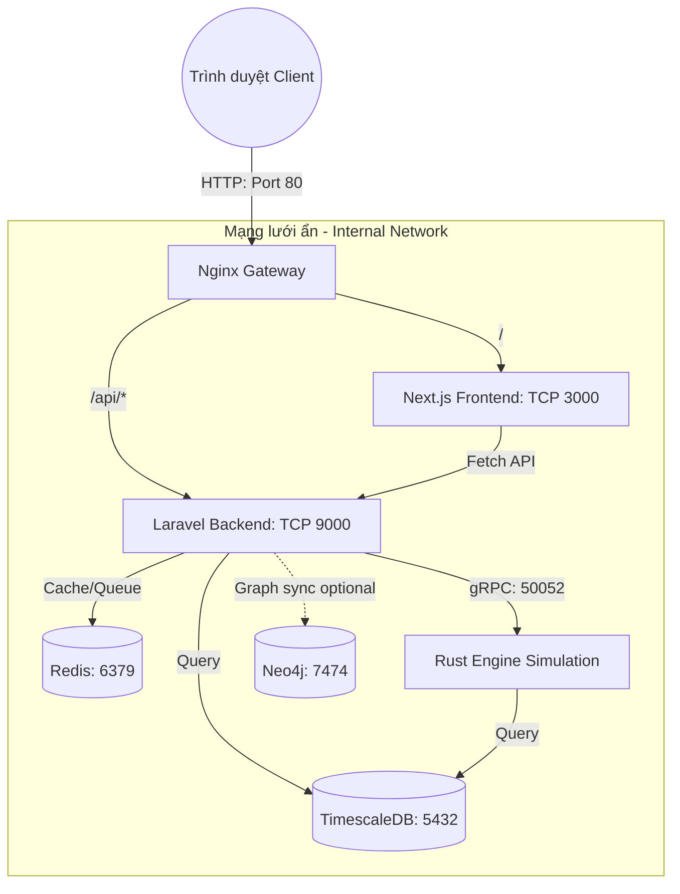

# Hệ thống Triển khai (Production Deployment) của WorldOS V6

Tài liệu này giải thích cấu trúc Docker mô phỏng môi trường Production của dự án WorldOS dựa trên tệp `docker-compose.prod.yml`. Điểm khác biệt lớn nhất giữa cấu trúc local và production là sự xuất hiện của **Nginx Reverse Proxy**.

## Sơ đồ Kiến trúc (Architecture Overview)



## Các Thành phần cốt lõi (Services Details)

Hệ thống được gói gọn trong một mạng nội bộ (`internal`), ngăn chặn quyền truy cập trực tiếp từ bên ngoài vào cơ sở dữ liệu hoặc mã nguồn chưa qua màng lọc.

### 1. Nginx Gateway (`nginx`)
- **Port mở ra ngoài Host**: `80` (Mặc định).
- **Vai trò**: Đón toàn bộ request từ người dùng ở cổng 80. Sau đó định tuyến (route):
  - Request nào bắt đầu bằng `/api` -> Gửi sang Laravel Backend.
  - Các request còn lại (`/`, `/dashboard`, v.v..) -> Gửi sang Next.js Frontend.
- **Lý do bảo mật**: Đảm bảo cả frontend và backend đều chạy cùng một tên miền chính (ví dụ `localhost` hoặc `worldos.com`), tránh được vấn đề CORS (Cross-Origin Resource Sharing).

### 2. Frontend (`frontend`)
- **Image build từ**: `deployment/frontend.prod.Dockerfile` (Chuẩn Next.js Standalone).
- **Trạng thái Ports**: KHÔNG MỞ RA NGOÀI (Exposed only to internal network).
- **Giao tiếp**: Render trang qua SSR hoặc tĩnh, và sử dụng đường dẫn tương đối `/api/...` để Nginx tự phân giải về Backend.

### 3. Backend (`backend`)
- **Image build từ**: `deployment/backend.prod.Dockerfile` (Chuẩn PHP-FPM siêu nhẹ).
- **Trạng thái Ports**: KHÔNG MỞ RA NGOÀI (Exposed only to internal network).
- **Giao tiếp**: Làm hệ thống đầu não Orchestrator, truy xuất Database và kết nối sang Engine (Rust).

### 4. Engine (`engine`)
- **Image**: Rust Workspace build release qua `deployment/engine.prod.Dockerfile`.
- **Vai trò**: Động cơ giả lập lõi hiệu năng cao (Core Simulation Engine) chạy theo chuẩn gRPC/HTTP bridge.

### 5. Database & Cache (`postgres`, `redis`)
- **Postgres (TimescaleDB)**: Lưu trữ Dữ liệu thời gian thực cho biểu đồ Entropy/Snapshot. Các volume data được mount vào máy tạo sự bền vững (`worldos_prod_pgdata`).
- **Redis**: Lưu Message Queue, Event Bus và các dữ liệu Cache nhẹ. Cả hệ thống dùng chung Redis để đồng bộ (Observer/PubSub).

### 6. Graph DB — Neo4j (`neo4j`) — Phase 5 Track B
- **Image**: `neo4j:5-community` (APOC plugin).
- **Vai trò**: WorldOS Data Graph — đồng bộ sự kiện simulation (Event/Actor nodes, relationships) khi bật graph sync.
- **Mặc định**: Graph sync tắt (`WORLDOS_GRAPH_ENABLED=false`). Bật bằng env:
  - `WORLDOS_GRAPH_ENABLED=true`
  - `WORLDOS_GRAPH_URI=http://neo4j:7474` (đã set mặc định trong compose)
  - `WORLDOS_GRAPH_USERNAME` / `WORLDOS_GRAPH_PASSWORD` khớp với `NEO4J_AUTH` (mặc định `neo4j/worldos_secret`).
- **Volume**: `worldos_prod_neo4jdata` cho dữ liệu Neo4j bền vững.

## Cách khởi chạy (How to run)

```bash
# 1. Đi vào thư mục deployment
cd deployment

# 2. Xây dựng lại ảnh (khi có thay đổi code Frontend/Backend)
docker compose -f docker-compose.prod.yml build

# 3. Khởi động môi trường Production ngầm
docker compose -f docker-compose.prod.yml up -d

# 4. Truy cập giao diện tại (Lưu ý: Không có port 3000!)
http://localhost
```

## Biến môi trường tùy chọn (Optional env)

- **Neo4j**: `NEO4J_AUTH=neo4j/your_password` (mặc định `neo4j/worldos_secret`). Khi bật graph sync, đặt `WORLDOS_GRAPH_PASSWORD` trùng với mật khẩu trong `NEO4J_AUTH`.
- **Event bus**: `WORLDOS_EVENT_BUS_DRIVER=redis_stream` để đẩy sự kiện qua Redis Stream (backend/scheduler/worker đã nhận env từ compose).

## Khắc phục sự cố thường gặp (Troubleshooting)

- **Frontend lỗi không tải được API**: Đảm bảo biến `NEXT_PUBLIC_API_URL` trong file Compose được đặt là `/api`.
- **Containers không cập nhật code**: Môi trường production không hỗ trợ "Hot Reload" như Local. Bất cứ khi nào bạn sửa code, bạn bắt buộc phải build lại container bằng `docker compose -f ... build [tên_service]`.
