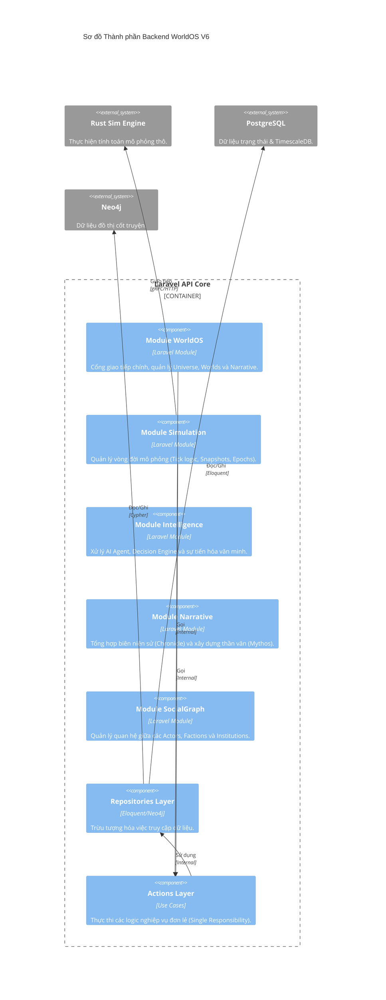

# Sơ đồ Thành phần (Component Diagram) - Backend Core

## Tổng quan
Backend của WorldOS V6 được xây dựng trên Laravel 12 theo kiến trúc **Modular Monolith**. Mỗi module chịu trách nhiệm cho một miền nghiệp vụ (Domain) cụ thể.

## Sơ đồ Mermaid

## Giải thích các Module chính
- **WorldOS**: Module bề mặt, cung cấp các API cho Frontend và quản lý các thực thể cấp cao như Đấng sáng tạo (Demiurges).
- **Simulation**: Điều phối `EpochEngine` và `ProphecyEngine`. Chịu trách nhiệm chuyển giao kỷ nguyên và quản lý dòng thời gian.
- **Intelligence**: Chứa các "Engine Swarm" để mô phỏng trí tuệ tập thể và các quyết định của Agent.
- **Narrative**: Chuyển đổi các sự kiện thô từ mô phỏng thành ngôn ngữ tự nhiên (Sử gia).
- **SocialGraph**: Mô phỏng sự tương tác phức tạp trong xã hội ảo.
