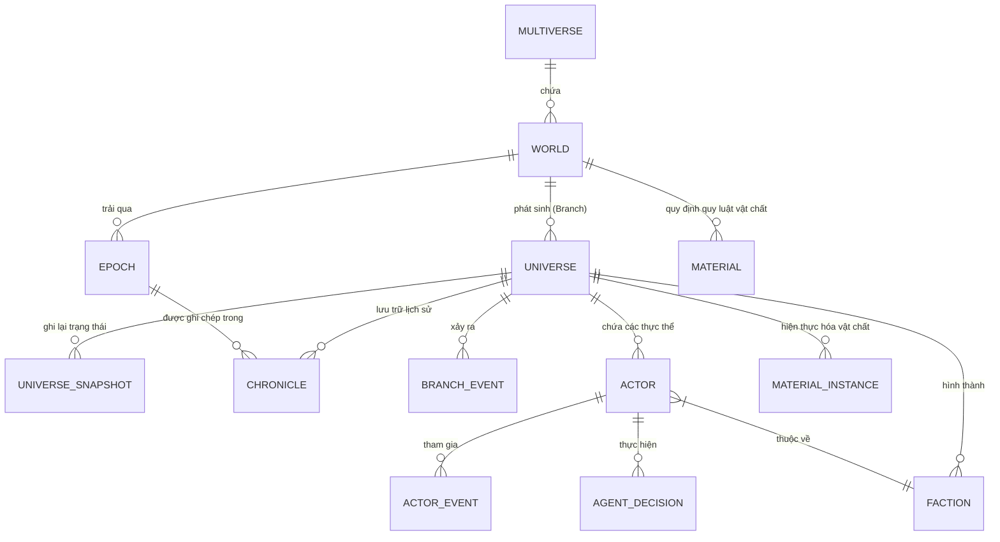

# Sơ đồ Quan hệ Thực thể (ERD)

## Tổng quan
WorldOS V6 sử dụng kiến trúc dữ liệu phân tầng từ Đa vũ trụ (Multiverse) đến các thực thể cá nhân (Actors).

## Sơ đồ Mermaid

## Các thực thể chính:
1. **Multiverse**: Đơn vị quản lý cao nhất, chứa nhiều thế giới song song.
2. **Universe**: Một nhánh thực tại cụ thể đang vận hành. Có trạng thái `active` hoặc `paused`.
3. **Epoch**: Các kỷ nguyên lịch sử (ví dụ: Stone Age, Bronze Age).
4. **Actor**: Các tác nhân thông minh (Agents) có hành vi và quyết định riêng.
5. **Chronicle**: Dữ liệu sự kiện đã được "Sử gia" xâu chuỗi thành ngôn ngữ tự nhiên.
6. **Snapshot**: Bản ghi thô của `stateVector` tại một tick cụ thể, dùng để khôi phục hoặc phân tích.
7. **Material**: Định nghĩa các thuộc tính vật chất (Stability, Rarity, Pressure) trong thế giới.
