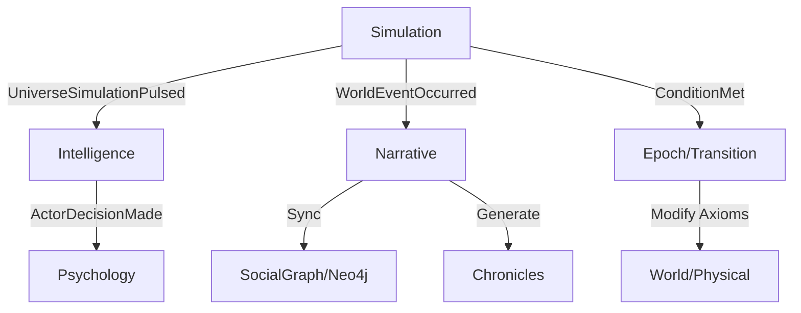

# Luồng Sự kiện Liên Module (Cross-Module Event Flows)

Tài liệu này mô tả cách các module trong WorldOS V6 tương tác với nhau để tạo ra một thực tại thống nhất.

## 1. Vòng lặp Mô phỏng (The Pulse Loop)
Đây là luồng quan trọng nhất, diễn ra sau mỗi Tick:

1. **Simulation Module**: Phát lệnh `Advance`.
2. **Rust Engine**: Tính toán biến đổi vật lý/môi trường thô.
3. **Simulation Module**: Ghi nhận Snapshot và phát sự kiện `UniverseSimulationPulsed`.
4. **Intelligence Module**: Lắng nghe sự kiện Pulse, kích hoạt `ActorBehaviorEngine` để các Actors đưa ra quyết định dựa trên môi trường mới.
5. **Psychology Module**: Hỗ trợ `Intelligence` dịch các sự kiện thành cảm xúc/ý nghĩa cho Actors.
6. **Institutions Module**: Tính toán các biến động cấp quốc gia/văn minh (ví dụ: áp lực sụp đổ, thăng hoa thực thể tối cao).

## 2. Luồng Biên niên sử (The Narrative Pipeline)
Xảy ra song song hoặc ngay sau vòng lặp mô phỏng:

1. **World Events**: Các biến cố quan trọng (Chiến tranh, Phát minh) phát sự kiện `WorldEventOccurred`.
2. **Narrative/HistoricalFactEngine**: Lưu lại sự kiện vào SQL.
3. **SocialGraph/Neo4jSyncer**: Đồng bộ các quan hệ nhân quả/xã hội sang đồ thị Neo4j.
4. **Narrative/ChronicleSynthesisEngine**: Tổng hợp dữ liệu từ Graph và SQL để tạo ra Fact Sheet.
5. **Narrative AI**: (Thông qua API bên ngoài) Chuyển Fact Sheet thành văn bản truyện kể.

## 3. Luồng Chuyển giao Kỷ nguyên (Epoch Transition)
Xảy ra khi các điều kiện DSL trong `EpochEngine` được thỏa mãn:

1. **Simulation/EpochEngine**: Phát hiện điều kiện thăng tiến (ví dụ: đạt Tech Level 5).
2. **TransitionEpochAction**: 
    - Đóng băng kỷ nguyên cũ.
    - Cập nhật các `Axiom Modifiers` (thay đổi quy luật vật lý/xã hội cho kỷ nguyên mới).
3. **World Module**: Cập nhật lại các engine vật lý (`Geography`, `MaterialReaction`) để phản ánh quy luật mới.
4. **Intelligence Module**: Các Actors có thể nhận được "Archetype" hoặc "Class" mới phù hợp với thời đại.

## 4. Sơ đồ Tóm tắt (Mermaid)

