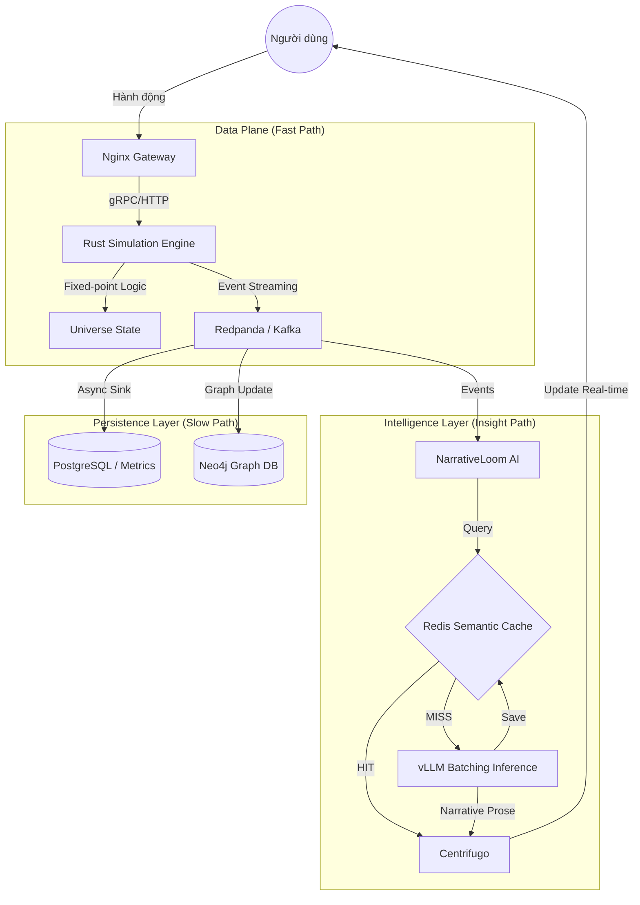

# System Design Document: Quy trình Dữ liệu WorldOS v6 (Master Hardfork)

Tài liệu này mô tả luồng dữ liệu chi tiết của hệ thống WorldOS sau khi thực hiện bản cập nhật Master Hardfork (Sprint 1-3), tập trung vào tính Deterministic, Hiệu năng cao và Trí tuệ nhân tạo tối ưu.

## 1. Tổng quan Kiến trúc Dữ liệu

Kiến trúc mới tách biệt hoàn toàn **Data Plane** (Luồng thực thi mô phỏng) và **Control Plane** (Luồng quản lý và Trí tuệ).

---

## 2. Chi tiết các Luồng Dữ liệu

### 2.1. Luồng Thực thi Mô phỏng (Fast Path)
Đây là luồng dữ liệu quan trọng nhất, yêu cầu độ trễ thấp nhất.
- **Input**: Các lệnh `run_advance` hoặc `run_observe` từ API.
- **Logic**: Rust Engine sử dụng số học **Fixed-point (I32F32)** để tính toán Entropy, Stability và các trường Civilization.
- **Output**: Thay vì trả về toàn bộ Snapshot, Engine đẩy các **Simulation Events** vào Kafka (Redpanda) theo thời gian thực.

### 2.2. Luồng Trí tuệ Nhân tạo (Intelligence Path)
Luồng này biến các con số mô phỏng khô khan thành nội dung kể chuyện.
- **Tiêu thụ Sự kiện**: NarrativeLoom lắng nghe Kafka.
- **Semantic Caching**: Trước khi gọi AI, hệ thống kiểm tra trong **Redis Stack** xem đã có câu trả lời tương tự (Cosine Similarity > 0.95) chưa.
- **Batching**: Nếu Cache Miss, các yêu cầu được gom nhóm (Batching) để gửi đến vLLM, giúp tận dụng tối đa sức mạnh tính toán song song của GPU.

### 2.3. Luồng Đồng bộ hóa Trạng thái (Consistency Path)
- **Real-time**: Centrifugo nhận prose từ AI và state từ Engine để đẩy xuống Frontend qua WebSocket.
- **Long-term**: Kafka Connect (hoặc Custom Sink) đẩy dữ liệu vào Postgres để vẽ biểu đồ và Neo4j để quản lý các mối quan hệ xã hội phức tạp giữa các Actor.

---

## 3. Các thành phần chính

| Thành phần | Vai trò | Công nghệ | Đột phá sau Hardfork |
| :--- | :--- | :--- | :--- |
| **Gateway** | Định tuyến & Bảo mật | Nginx | Bỏ qua PHP cho các luồng Sim traffic |
| **Engine** | Mô phỏng cốt lõi | Rust | Fixed-point Determinism & WASM |
| **Event Bus** | Vận chuyển sự kiện | Redpanda | Event Sourcing thay cho Snapshot |
| **AI Cache** | Bộ nhớ đệm trí tuệ | Redis Stack | Semantic Search (Vector) |
| **Inference** | Sinh văn bản | vLLM | Continuous Batching |

---

## 4. Tài liệu liên quan
- [[Roadmap]]
- [[ADR-001-Fixed-Point-Determinism]]
- [[Spec-AI-Batching]]
