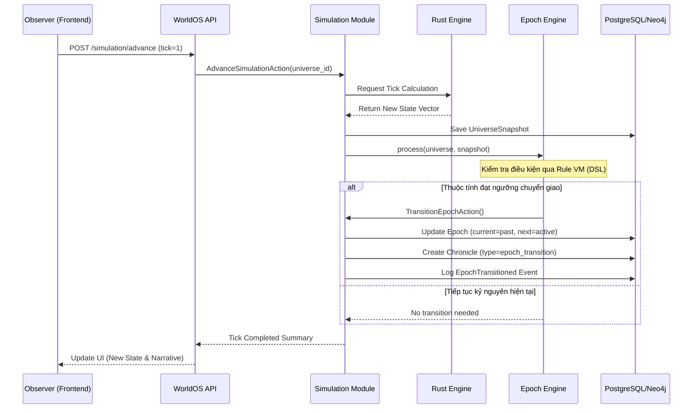

# Sơ đồ Tuần tự (Sequence Diagram)

## Quy trình Simulation Tick & Epoch Transition

Sơ đồ này mô tả cách hệ thống xử lý một bước mô phỏng (Tick) và cách nó tự động chuyển giao kỷ nguyên khi các điều kiện tích lũy đủ.

## Giải thích quy trình:
1. **Yêu cầu (Advance)**: Người quan sát hoặc CronJob gửi yêu cầu tiến hành mô phỏng.
2. **Tính toán (Rust)**: Engine Rust thực hiện các phép tính toán học nặng về vật lý và xã hội để trả về vector trạng thái mới.
3. **Giám sát (Epoch Engine)**: Sau mỗi tick, `EpochEngine` sẽ kiểm tra xem các chỉ số (Entropy, Tech,...) có kích hoạt việc chuyển đổi thời đại hay không.
4. **Lưu trữ (Persistence)**: Trạng thái được lưu vào PostgreSQL (chuỗi thời gian) và Narrative được cập nhật vào Neo4j nếu có sự kiện lớn.
