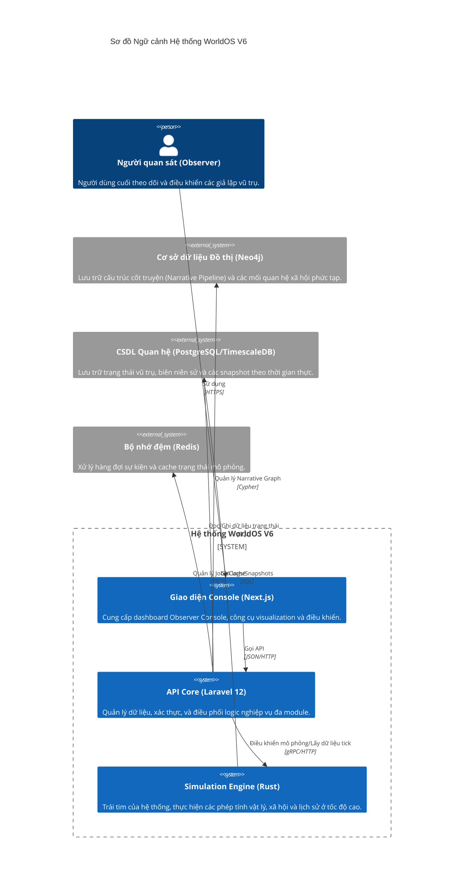

# Sơ đồ Ngữ cảnh Hệ thống (System Context Diagram)

## Tổng quan
WorldOS V6 là một hệ thống mô phỏng vũ trụ đa tầng, cho phép người dùng (Người quan sát) theo dõi và tác động đến sự tiến hóa của các nền văn minh thông qua giao diện điều khiển cấp cao.

## Sơ đồ Mermaid

## Các thành phần chính
1. **Người quan sát (Observer)**: Vai trò của người dùng trong hệ thống, có khả năng can thiệp vào các quy luật (Axioms) của vũ trụ.
2. **Giao diện Console**: Được thiết kế dưới dạng "Observer's Console" toàn màn hình, tập trung vào trải nghiệm nhập vai.
3. **API Core**: Triển khai theo mô hình Modular Monolith, giúp dễ dàng mở rộng và bảo trì các tính năng như Tâm lý học (Psychology), Xã hội (Social Graph), v.v.
4. **Simulation Engine**: Xử lý logic mô phỏng cực nhanh bằng Rust, tách biệt khỏi logic nghiệp vụ của backend.
5. **Data Layer**: Sử dụng mô hình Hybrid giữa SQL (dữ liệu chuỗi thời gian) và Graph (dữ liệu quan hệ lịch sử).
