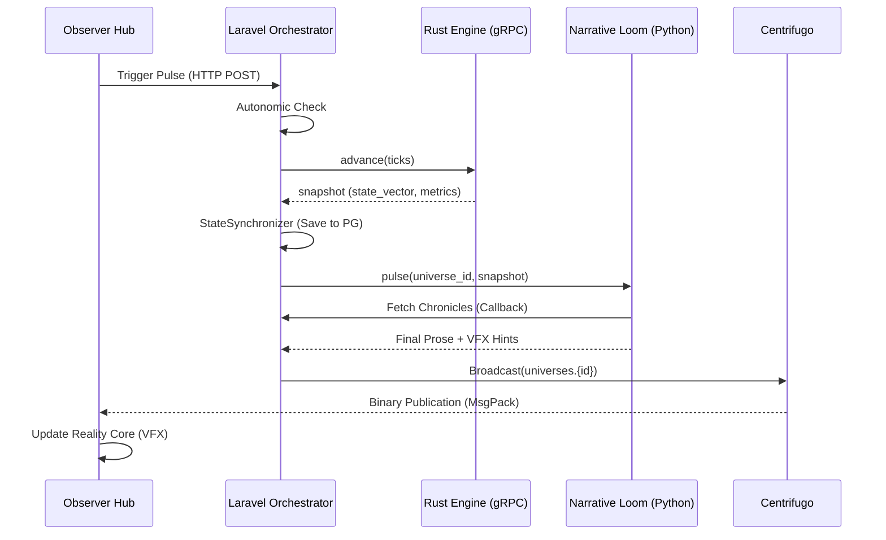

# Review Session 1: Architecture & Data Flow (Audit Report)

## 1. Bản đồ Kiến trúc (The Map)

Hệ thống WorldOS v6 vận hành theo mô hình **Hybrid Event-Driven Orchestration**.

### 1.1. Các lớp (Layers)
- **Layer 1: Orchestrator (Laravel 10+)**: 
    - Đóng vai trò "Hệ điều hành" (World Kernel).
    - Quản lý nhịp (Pulse), Trình giám sát tính toán (SimulationSupervisor), và Lưu trữ trạng thái (PostgreSQL).
- **Layer 2: Calculation Engine (Rust/gRPC)**:
    - Xử lý các phép tính vật lý thô, thực thể số lượng lớn và DSL (RuleVM).
- **Layer 3: Cognitive Layer (Python Microservices)**:
    - **Narrative Loom**: LangGraph pipeline để dệt cốt truyện.
    - **Oasis Social Engine**: Sinh Persona và mô phỏng hành vi xã hội.
- **Layer 4: Memory & Knowledge (Neo4j, Zep, Redis)**:
    - Neo4j: Lưu trữ đồ thị quan hệ xã hội.
    - Zep: Lưu trữ hồi ức dài hạn (LTM) cho từng Agent.
- **Layer 5: Presentation (Next.js, Centrifugo)**:
    - Nhận dữ liệu thời gian thực qua WebSocket để render VFX 3D.

---

## 2. Luồng dữ liệu "Pulse" (Data Lifecycle)

---

## 3. Đánh giá Kỹ thuật (Audit Findings)

### ✅ Ưu điểm (Strengths)
1. **Zero-Fetch Update**: Giao thức nhị phân của Centrifugo cho phép Frontend cập nhật trạng thái mà không cần gọi lại API HTTP, giảm tải đáng kể cho server khi có hàng ngàn user quan sát.
2. **Autopoietic Loop**: Cơ chế AI Mutation (Narrative Loom tác động ngược lại Simulation qua MutationEngine) tạo ra một vòng lặp tiến hóa tự thân thực sự.
3. **Decoupled Knowledge**: Tri thức về kỷ nguyên (Era) và sức mạnh (Power) được tách riêng giúp việc mở rộng nội dung không cần chạm vào code logic.

### ⚠️ Rủi ro & Nút thắt (Risks & Bottlenecks)
1. **Circular Call Pattern**: `NarrativeLoom` gọi ngược lại `backend/api/loom` để lấy dữ liệu. 
    - *Rủi ro*: Gây lãng phí băng thông và tăng nguy cơ timeout. 
    - *Đề xuất*: Laravel nên đóng gói dữ liệu cần thiết vào body của request POST gửi sang Python.
2. **Memory Consistency**: Sự sai lệch giữa PostgreSQL (State Truth) và Neo4j/Zep (Cognitive Truth) có thể dẫn đến việc Agent hành động dựa trên những hồi ức không còn tồn tại trong thực tại vật lý.
3. **Local LLM Latency**: Sử dụng `MythoMax-L2-13B` cục bộ có thể gây delay từ 5-15s cho mỗi nhịp Narrative. 
    - *Đề xuất*: Cần triển khai `NarrativeQueueManager` mạnh mẽ hơn để xử lý bất đồng bộ hoàn toàn.

---

## 4. Kết luận Session 1
Kiến trúc hiện tại rất mạnh mẽ và có tính module hóa cao. Tuy nhiên, việc tối ưu hóa luồng gọi API giữa PHP và Python là ưu tiên hàng đầu để đảm bảo tính ổn định của Simulation Pulse.

> [!TIP]
> **Next Step**: Chuyển sang **Session 2: Physics & Calculation Engine** để xem cách các con số được tính toán chính xác như thế nào trong Rust và Laravel Kernel.
