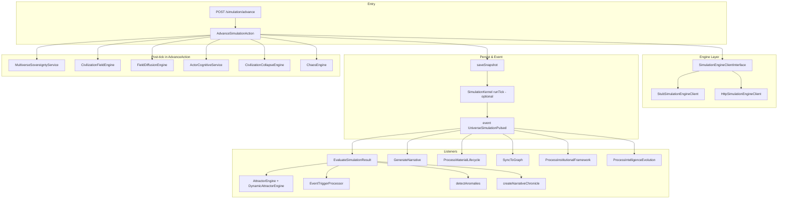

# Simulation Review – WorldOS

Tài liệu tóm tắt kiến trúc, luồng và các điểm cần lưu ý của simulation.

---

## 1. Tổng quan luồng

- **Advance:** `AdvanceSimulationAction::execute(universeId, ticks)` gọi engine client → nhận snapshot → lưu snapshot (theo `snapshot_interval`) → fire `UniverseSimulationPulsed`.
- **Listeners:** Đa số logic “sau mỗi tick” nằm trong listener `EvaluateSimulationResult` (attractor, event trigger, anomaly, chronicle, pressure, edict, great filter, ascension, narrative, …) và các listener khác lắng nghe `UniverseSimulationPulsed`.
- **Post-tick trong Action:** Field engine, diffusion, cognitive, collapse, chaos, sovereignty, v.v. chạy ngay trong `AdvanceSimulationAction` sau khi snapshot được lưu.

---

## 2. Engine client (nguồn entropy/stability)

- **Interface:** `SimulationEngineClientInterface::advance(universeId, ticks, stateInput, worldConfig)` → `{ ok, snapshot, error_message }`.
- **Engine thật (mặc định khi có config):** `HttpSimulationEngineClient` — gọi engine Rust qua HTTP (`POST {baseUrl}/advance`). Dùng khi `SIMULATION_ENGINE_GRPC_URL` (trong `.env`) được set và bắt đầu bằng `http://` hoặc `https://`. Snapshot (entropy, stability_index, state_vector, metrics) đến từ engine Rust.
- **Stub:** `StubSimulationEngineClient` chỉ dùng khi **không** set URL (hoặc URL không http/https). Trả về entropy/stability cố định từ state input → timeline sẽ phẳng nếu chạy với stub.

**Khi dùng engine thật:** Timeline trên dashboard phản ánh đúng dữ liệu engine trả về. Laravel **luôn đồng bộ** `universe.state_vector` và `current_tick` từ response engine mỗi tick (`syncUniverseFromSnapshotData`), kể cả khi không lưu snapshot row (khi `tick % snapshot_interval !== 0`). Nhờ vậy lần `advance()` tiếp theo gửi state mới cho engine → entropy/stability có thể thay đổi. Trước khi sửa, khi không lưu snapshot thì state không sync → engine nhận mãi state cũ → entropy không đổi.

---

## 3. Snapshot & SimulationKernel

- **Lưu snapshot:** Chỉ khi `tick % snapshot_interval === 0` (hoặc tick 0). Trường: `tick`, `state_vector`, `entropy`, `stability_index`, `metrics`.
- **SimulationKernel (optional):** Bật bởi `config('worldos.simulation_kernel_post_tick')`. Sau khi lưu snapshot, kernel chạy `runTick` (effect-based, deterministic) rồi **ghi đè** snapshot bằng state mới. Các engine đăng ký qua `registerEngine(SimulationEngine, tickFactor)`.

---

## 4. Anomaly

- **Phát hiện (trong listener):** `EvaluateSimulationResult::detectAnomalies()`:
  - entropy > 0.95 → CRITICAL (Void Gate)
  - stability < 0.2 → CRITICAL (Sụp đổ cấu trúc)
  - material_stress > 0.8 → WARN (Căng thẳng vật chất)
- **Event:** `AnomalyDetected` (ShouldBroadcast) → realtime qua channel `universe.{id}` và `simulation.alerts`. **Không lưu DB** (chỉ broadcast).
- **API dashboard:** `UniverseAnomalyController::index()` **không** đọc event mà **query snapshot**: `entropy > 0.9 OR stability_index < 0.25 OR material_stress > 0.7` → map snapshot thành danh sách anomaly. Vì vậy dashboard vẫn thấy anomaly từ dữ liệu snapshot ngay cả khi không có listener/websocket.
- **AnomalyGeneratorService:** Dùng bởi `PulseWorldAction` (và có thể chỗ khác). Tạo anomaly “chaos” (biological_hivemind, spatial_fracture, axiom_duplication), ghi chronicle + sửa `state_vector`. **ChaosEngine** không gọi AnomalyGeneratorService; nó chỉ `destabilize()` (paradox) khi world `is_chaotic` với xác suất rất thấp.

---

## 5. Attractor & Event trigger

- **AttractorEngine:** Đánh giá attractor từ config (`civilization_attractors`), ghi `active_attractors` vào `universe.state_vector`.
- **DynamicAttractorEngine:** Decay/spawn `attractor_instances`, merge vào `active_attractors`.
- **EventTriggerProcessor:** Dùng `active_attractors` (force_map) + rules/cooldown/probability → tạo BranchEvent (ví dụ fork, collapse). Chronicle và branch_events là nguồn cho Event timeline và Collapse monitor trên dashboard.

---

## 6. CivilizationFieldEngine & Collapse

- **CivilizationFieldEngine:** Tính 5 field (survival, power, wealth, knowledge, meaning) từ state + alignment, ghi vào `state_vector['fields']` và per-zone nếu có zones.
- **FieldDiffusionEngine:** Lan truyền field giữa các zone.
- **CivilizationCollapseEngine:** Điều kiện collapse (entropy vs stability threshold) → đánh dấu institution collapsed, spawn attractor fragment, chronicle `civilization_collapse`.

---

## 7. Điểm mạnh

- Tách rõ: engine client (stub/HTTP) → snapshot → event → nhiều listener độc lập.
- Attractor + event trigger data-driven (rules, force_map).
- Field engine + diffusion + collapse tạo “civilization dynamics”.
- Anomaly broadcast realtime; dashboard vẫn hoạt động qua query snapshot khi không dùng websocket.
- SimulationKernel cho deterministic post-tick effects (optional).

---

## 8. Rủi ro & gợi ý

| Vấn đề | Gợi ý |
|--------|--------|
| Timeline phẳng dù đã dùng engine thật | Kiểm tra response engine (entropy/stability có đổi theo tick); kiểm tra `snapshot_interval` (world) — nếu > 1 thì không mỗi tick đều lưu snapshot. |
| AnomalyDetected chỉ broadcast, không lưu DB | Nếu cần lịch sử anomaly, thêm listener lưu vào bảng `anomalies` (hoặc tương đương) khi fire event. |
| EvaluateSimulationResult xử lý rất nhiều thứ trong một listener | Cân nhắc tách thành nhiều listener nhỏ (e.g. AttractorListener, AnomalyListener) để dễ test và bảo trì. |
| ChaosEngine không gọi AnomalyGeneratorService | Nếu muốn “unclassifiable” anomaly từ chaos, có thể gọi `AnomalyGeneratorService::spawnAnomaly()` trong ChaosEngine khi trigger paradox (hoặc điều kiện tương đương). |
| Snapshot không lưu mỗi tick | Giữ nguyên interval; đảm bảo engine trả đủ metric (entropy, stability) trong snapshot để timeline/observatory đủ ý nghĩa. |

---

## 10. Các lỗi đã sửa (rà soát engine/simulation)

| Vấn đề | Cách xử lý |
|--------|------------|
| Khi `tick % snapshot_interval !== 0` không lưu snapshot → event nhận snapshot **cũ** từ DB → listener xử lý sai tick/entropy, storePressureMetrics ghi đè metrics lên bản ghi cũ | Luôn tạo **virtual snapshot** từ `snapshotData` khi `!shouldSave`, truyền vào event. Listener nhận đúng tick/entropy/stability hiện tại. |
| `storePressureMetrics` gọi `$snapshot->save()` trên snapshot ảo → không nên persist | Nếu `!$snapshot->exists`: cập nhật metrics vào bản ghi snapshot **mới nhất** trong DB (để dashboard có số liệu gần đúng), không gọi save trên snapshot ảo. |
| `detectAnomalies`: truy cập `$snapshot->metrics['material_stress']` khi metrics rỗng → undefined index | Dùng `($snapshot->metrics['material_stress'] ?? 0) > 0.8`. |
| `prepareWorldConfig`: `(string) $world->current_origin ?? 'generic'` khi `current_origin` null → chuỗi rỗng | Dùng `(string) ($world->current_origin ?? $world->origin ?? 'generic')`. |
| Level 7 (field engine, collapse) chạy cả khi snapshot ảo | Chỉ chạy khi `$shouldSave && $savedSnapshot && $savedSnapshot->exists`. |
| GenerateNarrative: sau sync universe, `current_tick === snapshot->tick` → `fromTick === toTick` → không gọi generateChronicle | Truyền `_ticks` trong `engineResponse`; listener dùng `fromTick = snapshot->tick - (engineResponse['_ticks'] ?? 1)`. |
| ProcessMaterialLifecycle: `state_vector` null/không array → lỗi khi đọc scars | Dùng `($snapshot->state_vector ?? [])['scars'] ?? []` và `$metrics = $snapshot->metrics ?? []` trước array_merge. |
| AdvanceSimulationAction: universe không có world → lỗi khi dùng `$universe->world->snapshot_interval` | Guard sớm: nếu `!$universe->world` trả về `['ok' => false, 'error_message' => 'Universe has no world']`. |
| findMergeCandidates trả về trùng cặp (a,b)/(b,a) hoặc trùng key | Chuẩn hóa cặp `min(a,b), max(a,b)`, dùng `$seen[$key]` để dedupe rồi mới thêm vào kết quả. |
| MultiverseSovereigntyService: `state_vector` null khi đọc knowledge_core | Dùng `($snapshot->state_vector ?? [])['knowledge_core'] ?? 0.0`. |
| **Tiếp tục rà (batch 2)** | |
| SoulAnchorService: `$dyingUniverse->world` null → lỗi khi lấy global_tick | Dùng `$dyingUniverse->world?->global_tick ?? 0`. |
| MultiverseSovereigntyService / OvermindEvolutionAction: `$universe->world` null khi gọi is_autonomic | Guard: `if (!$universe->world \|\| !$universe->world->is_autonomic) return;` và trong recycleKnowledge kiểm tra `$world` trước khi dùng. |
| StagnationDetectorListener: entropy/stability_index null → cảnh báo khi trừ | Dùng `($snapshot->entropy ?? 0)` và tương tự cho previousSnapshot. |
| SyncToGraph: state_vector null gửi vào graph | Truyền `$snapshot->state_vector ?? []`. |
| EvaluateSimulationResult storePressureMetrics: entropy/stability_index null | Gán `$state['entropy'] = $snapshot->entropy ?? 0` (và stability_index tương tự). |
| ResonanceEngine: world null khi gọi epochs(); state_vector null | Guard `if (!$u1->world \|\| !$u2->world) return 0;` và `$v1 = $s1->state_vector ?? []`. |
| MultiverseInteractionService: world null trong isResonant; state_vector['agents'] null | Guard `if (!$a->world \|\| !$b->world) return false;` và `($snapshot->state_vector ?? [])['agents'] ?? []`. |
| TemporalSyncService, OriginSeeder, AnomalyGeneratorService, ActorEvolutionService, SpawnFromEventsAction: world null | Dùng `$universe->world?->...` hoặc guard `$world = $universe->world; if (!$world) return;`. |
| GetUniverseTopologyAction: state_vector null hoặc json_decode lỗi | `(json_decode(..., true) ?? [])` và `($snapshot->state_vector ?? [])`. |
| **Batch 3** | |
| UniverseSnapshotRepository::enrich: metrics/state_vector null | `($snapshot->metrics ?? [])['instability_gradient']` và `($snapshot->state_vector ?? [])['epistemic_instability'] ?? 0`. |
| OmegaPointEngine: state_vector null khi đọc innovation | `($snapshot->state_vector ?? [])['innovation'] ?? 0`. |
| LoomWorldStateController, InstitutionEvolutionService, KernelMutationService, RunMicroCycleAction, DetectEmergentCivilizationsAction, MemoryService: universe.state_vector null | Dùng `($universe->state_vector ?? [])['key'] ?? default` cho zones, axioms, scars, metrics, historical_phase_scores, entropy. |
| WorldEdictEngine::decree: world null; save snapshot ảo | Guard đầu decree `if (!$universe->world) return;`. Chỉ `$snapshot->save()` khi `$snapshot->exists`; nếu ảo thì cập nhật metrics vào snapshot mới nhất. |
| ZoneConflictEngine, DiplomaticResonanceEngine: save snapshot ảo | Chỉ `$snapshot->save()` khi `$snapshot->exists`; nếu ảo thì ghi zones/diplomacy vào `$universe->state_vector` và `$universe->save()`. |
| EvaluateSimulationResult: world null khi gọi worldRegulatorEngine | Chỉ gọi `worldRegulatorEngine->process($universe->world)` khi `$universe->world` tồn tại. |
| SyncToGraph: snapshot ảo có id null | Truyền `snapshot_id => $snapshot->exists ? $snapshot->id : null`; log ghi rõ (virtual) khi không exists. |
| DiplomaticResonanceEngine: biến $civArray sai tên | Sửa thành $civsArray khi gán $civA, $civB. |
| **Zones không sinh sau 100 tick** | Bootstrap: `ensureStateVectorHasZones()` trong AdvanceSimulationAction khi engine trả về state_vector không có zones; GetUniverseTopologyAction fallback sang `universe.state_vector['zones']` khi snapshot không có. |
| **Batch 4 – null-safe và type** | |
| Modules\\ConvergenceEngine (shouldConverge): metrics/alignment null; alignment không phải array | `($snapA->metrics ?? [])['alignment'] ?? null` và kiểm tra `is_array($alignA)` trước khi dùng. |
| MythicResonanceEngine: state_vector null; decree nhận array thay vì UniverseSnapshot | `($latest->state_vector ?? [])['zones'] ?? []`; gọi `decree($universe, $latest)` thay vì truyền array (type-safe). |
| TheDreamingService, ArchetypeShiftAction: state_vector null khi đọc zones | `($latest->state_vector ?? [])['zones'] ?? []`. |
| RelationalGraphProvider: metrics null | `($s->metrics ?? [])['material_stress'] ?? 0`. |
| UniverseEloquentRepository (Modules): state_vector null | `($model->state_vector ?? [])['entropy']` và stability_index. |
| WorldRegulatorEngine: state_vector null trong closure | `($u->state_vector ?? [])['entropy']` (và innovation, stability_index, population). |
| SerialStoryService, WorldAdvisorService: state_vector/scars null | `($latestSnapshot?->state_vector ?? [])['zones'] ?? []`; `($latest?->state_vector ?? [])['scars'] ?? []`. |
| ArchetypeShiftAction: \DB undefined | Thêm `use Illuminate\Support\Facades\DB` và dùng `DB::raw()`. |
| **Luồng Material (ProcessMaterialLifecycle)** | |
| PressureResolver::apply: instance->material null (material xóa hoặc FK lỗi) | Đầu hàm: `if (!$instance->material) return [];`. |
| MaterialLifecycleEngine: ontology count và vòng lặp dùng instance->material | Chỉ đếm ontology khi `$instance->material` tồn tại; bỏ qua instance khi `!$instance->material` trong vòng chính; guard trong canActivate, shouldBecomeObsolete, checkMutations. |
| MaterialEvolutionEngine: instance->material và mutation->childMaterial null | processLifecycles: `if (!$material) continue;`; processMutations: load `with('material')`, `if (!$instance->material) continue;`, và `if (!$mutation->childMaterial) continue;`; log dùng `$instance->material?->name`. |

## 11. File tham chiếu nhanh

| Vai trò | File |
|--------|------|
| Entry | `app/Actions/Simulation/AdvanceSimulationAction.php` |
| Engine stub | `app/Services/Simulation/StubSimulationEngineClient.php` |
| Event pulse | `app/Events/Simulation/UniverseSimulationPulsed.php` |
| Listener chính | `app/Listeners/Simulation/EvaluateSimulationResult.php` |
| Anomaly event | `app/Events/Simulation/AnomalyDetected.php` |
| Anomaly API | `app/Http/Controllers/Api/UniverseAnomalyController.php` |
| Anomaly generator | `app/Services/Simulation/AnomalyGeneratorService.php` |
| Chaos | `app/Services/Simulation/ChaosEngine.php` |
| Attractor | `app/Services/Simulation/AttractorEngine.php`, `DynamicAttractorEngine.php` |
| Field & collapse | `app/Services/Simulation/CivilizationFieldEngine.php`, `CivilizationCollapseEngine.php` |
| Kernel | `app/Simulation/SimulationKernel.php` |
