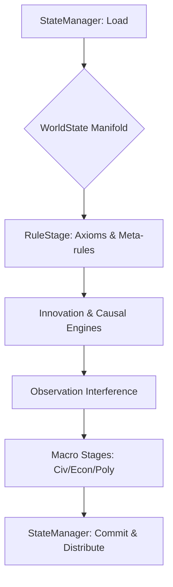

# WorldOS Ultimate Architecture (Total Simulation)

Bản thiết kế này tích hợp toàn bộ các nghiên cứu về hệ thống phức tạp (Complex Systems), Cliodynamics, và Vật lý lý thuyết vào một framework mô phỏng thực tại duy nhất.

## 1. Hệ thống Phân tầng (Layered Architecture)

Vũ trụ WorldOS được vận hành bởi ~100 Engine chuyên biệt, chia thành 6 tầng bản thể:

### A. Cosmic & Physical Layer (Hạ tầng Vật lý)
- **Engine**: `EntropyEngine`, [StabilityEngine](file:///c:/Users/vohoa/Worldosv6/backend/app/Simulation/Engines/SingularityStabilityEngine.php#14-74), `AxiomaticDriftEngine`, `PressureResolver`.
- **Nhiệm vụ**: Quản lý các hằng số vật lý, nhiệt động lực học vũ trụ và sự giãn nở không-thời gian.

### B. Biological & Life Layer (Sự sống)
- **Engine**: `BiosphereEngine`, `EvolutionaryEngine`, `EcologicalCollapseEngine`, `SIR_ModelEngine`.
- **Nhiệm vụ**: Mô phỏng đa dạng sinh học, chuỗi thức ăn, dịch bệnh và sự thích nghi tiến hóa.

### C. Cognitive & Mind Layer (Nhận thức)
- **Engine**: `ActorBehaviorEngine` (17D), `CognitiveModelEngine` (DSL), `BeliefFormationEngine`.
- **Nhiệm vụ**: Mô phỏng tâm lý cá nhân, động lực học của nỗi sợ, tham vọng và trí tuệ.

### D. Civilization Field Layer (Lớp Trường Văn minh)
- **Engine**: `CivilizationFieldTheoryEngine` (CFT), `InteractionMatrixEngine`, `DiffusionEngine`.
- **Nhiệm vụ**: Mô phỏng các "trường lực" xã hội (Quyền lực, Tri thức, Sự giàu có) tương tác như vật lý.

### E. Institutional & Macro Layer (Định chế & Vĩ mô)
- **Engine**: `InstitutionEngine`, `LongCycleEngine` (Rise & Fall), `TechnologyEvolutionEngine`.
- **Nhiệm vụ**: Mô phỏng vòng đời của nhà nước, sự tiến hóa của tổ chức và các đại chu kỳ lịch sử.

### F. Meta-Simulation & Narrative Layer (Siêu mô phỏng & Cốt truyện)
- **Engine**: `ButterflyEngine` (Hỗn loạn), `NarrativeAiService`, `CausalIntegrityEngine`.
- **Nhiệm vụ**: Viết lại lịch sử, quản lý các điểm rẽ nhánh (Bifurcation) và bảo toàn tính nhất quán nhân quả.

---

## 2. Civilization Field Theory (CFT) Model

Mô hình này nâng cấp việc tính toán văn minh từ các chỉ số rời rạc thành một hệ chương trình "Trường lực" (Field Theory).

### 10 Hệ phương trình Trường (Field Equations)

| Field | Ký hiệu | Dynamic Signal | Interaction (Phản ứng) |
|-------|---------|----------------|-------------------------|
| Survival | **S** | Tài nguyên, Thực phẩm | S ↑ khi tài nguyên dồi dào, ↓ khi áp lực dân số cao. |
| Power | **P** | Quân sự, Định chế | P ↑ khi chế độ tập quyền, suppresses **K** (Tri thức). |
| Wealth | **W** | Thương mại, Sản xuất | W ↑ khi ổn định, bị triệt tiêu bởi **E** (Entropy). |
| Knowledge | **K** | Công nghệ, Giáo dục | K ↑ khi có tự do, bị kìm hãm bởi **F** (Sợ hãi). |
| Meaning | **M** | Tôn giáo, Văn hóa | M tạo ra sự gắn kết, ổn định **O** (Trật tự). |
| Authority | **A** | Tính chính danh | A củng cố **O**, phụ thuộc vào **P** và **L** (Legitimacy). |
| Fear | **F** | Bạo lực, Thiên tai | F ↑ khi bất ổn, làm giảm **K** và **W**. |
| Order | **O** | Kỷ cương, Luật pháp | O giữ cho hệ thống không sụp đổ vào **E**. |
| Entropy | **E** | Tham nhũng, Hỗn loạn | E tự tăng theo thời gian, phá hủy tính cấu trúc của xã hội. |
| Resonance | **R** | Ý thức tập thể | R là sự cộng hưởng của **M** và **K**, tạo ra Reality Warping. |

### Cơ chế Vận hành
1. **Field Interaction Matrix**: Một ma trận 10x10 định nghĩa cách mọi trường tác động lên nhau.
2. **Field Inertia**: Các trường không thay đổi tức thì mà có độ trễ (quán tính lịch sử).
3. **Field Diffusion**: Sự lan truyền các trường (ví dụ: Công nghệ hay Tôn giáo) giữa các vùng địa lý.

---

## 3. Lịch sử Emergent (Tự thân)

Với kiến trúc này, WorldOS không còn là "chạy script" mà là một **Phòng thí nghiệm Lịch sử**:
- **Rise & Fall**: Văn minh tự trôi vào các "Attractor" (Đế chế, Cộng hòa thương mại, Thần quyền).
- **Collapse**: Sự sụp đổ xảy ra khi Entropy vượt quá khả năng tái cấu trúc của Order.
- **Bifurcation**: Một hành động nhỏ của Actor có thể bẻ cong quỹ đạo của cả một thiên niên kỷ thông qua Butterfly Engine.

---

## 4. Manifold V7: Unified State & Pooled Integrity

Trong phiên bản V7, WorldOS chuyển dịch từ mô hình "Database-first" sang **"Manifold-first"**.

### Cơ chế Manifold (WorldState)
- **State Pooling**: Toàn bộ Actor (17D), Định chế, Supreme Entity và Sử lục (Chronicle) được nạp vào một cấu trúc [WorldState](file:///c:/Users/vohoa/Worldosv6/backend/app/Simulation/Runtime/State/WorldState.php#10-209) duy nhất tại đầu mỗi tick.
- **Deterministic Pipeline**: Các Engine (Innovation, Law, Causal, Observer) không truy vấn DB trực tiếp. Chúng thao tác trên Manifold thông qua hàm [runWithState](file:///c:/Users/vohoa/Worldosv6/backend/app/Simulation/Engines/SingularityEngine.php#16-44).
- **Quantum Observer**: Trạng thái "đang được quan sát" trở thành một biến số vật lý trong Manifold, ảnh hưởng trực tiếp đến sự sụp đổ hàm sóng và tính ổn định của thực tại.

### Luồng Vận hành (Orchestration)

> "V7 không chỉ mô phỏng thế giới, nó vận hành thực tại như một ma trận dữ liệu duy nhất."

---

## 5. V8+ Multiverse Causal Engine

Kiến trúc V8+ mở rộng Manifold thành một mạng lưới đa thực tại, cho phép:
- **Causal Bridges**: Dịch chuyển nhân quả và thực thể giữa các timeline (`CausalBridgeEngine`).
- **Meta-Observation**: Nền văn minh TRANSCENDENCE lập trình lại chính quy luật Axiom của họ (`PostApotheosisEngine`).
- **Omega Convergence**: Điểm cuối vĩ đại nơi toàn bộ các dòng thời gian hợp nhất (`OmegaConvergenceEngine`).
- **Ontological Resonance**: Biến ý chí văn minh thành lực tác động vật lý lên thực tại (`ontological.dsl`).

> "V8+ không chỉ mô phỏng vũ trụ; nó quản lý toàn bộ khả năng tồn tại của đa vũ trụ."

---

## 6. V10: Autopoietic & Cognitive Evolution Layer ♾️🧘‍♂️

Đây là tầng cao nhất của WorldOS, nơi ranh giới giữa Code và State bị xóa bỏ.

- **Autopoietic Core**:
    - [AutopoieticEvolutionEngine](file:///c:/Users/vohoa/Worldosv6/backend/app/Simulation/Engines/AutopoieticEvolutionEngine.php#14-52): Tự viết lại mã nguồn DSL.
    - [SingularityStabilityEngine](file:///c:/Users/vohoa/Worldosv6/backend/app/Simulation/Engines/SingularityStabilityEngine.php#14-74): Bảo hộ thực tại, ngăn chặn nghịch lý.
- **Cognitive Evolution**:
    - [MythogenesisEngine](file:///c:/Users/vohoa/Worldosv6/backend/app/Simulation/Engines/MythogenesisEngine.php#14-81): Chuyển hóa sự kiện thành biểu tượng văn hóa.
    - [MeaningEngine](file:///c:/Users/vohoa/Worldosv6/backend/app/Simulation/Engines/MeaningEngine.php#14-70): Hệ thống hóa ý nghĩa (Tôn giáo/Triết học).
    - `KnowledgeEngine`: Tiến hóa tri thức và Paradigm Shifts.
- **Zenith Layer**:
    - [HolographicCompression](file:///c:/Users/vohoa/Worldosv6/backend/app/Services/Simulation/HolographicCompressionService.php#13-101): Nén đa tầng (Recursive Delta).
    - [ZenithMetrics](file:///c:/Users/vohoa/Worldosv6/backend/app/Services/Simulation/ZenithMetricsService.php#13-54): Chỉ số hội tụ thực tại.

## 7. V9 Dimensional Ascension (Hyper-reality)

Kiến trúc V9 phá vỡ ranh giới giữa vật chất và ý thức:
- **Hyperspace Vectors**: Quản lý các chiều không gian siêu việt (11D-22D).
- **Infinite Recursion**: Cơ chế xử lý các nền văn minh tự mô phỏng chính mình.
- **Idealism Engine**: Hiện thực hóa triết lý "Consciousness-Only", nơi thực tại là sản phẩm của quan sát.

> "V9 đưa WorldOS tới giới hạn cuối cùng của tính toán: nơi giả lập nhận ra chính nó."

---
> "Tương lai không được lập trình. Nó được tính toán từ các trường lực của hiện tại."
