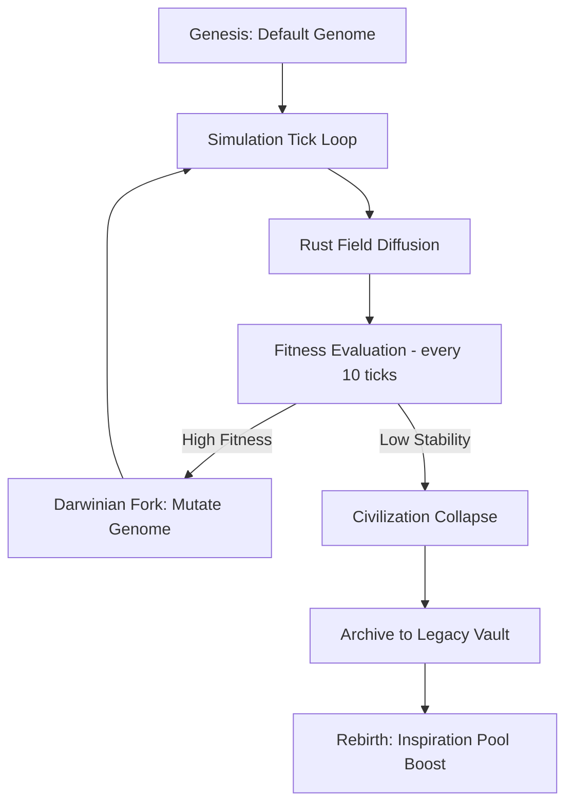

# WorldOS v23: Level 7 – Civilization Attractor Field Engine
## System Specification & As-Built Documentation (Phase 8 Integrated)

---

## 📐 Mathematical Foundations (The Physics of Level 7)

WorldOS Level 7 chuyển đổi từ các biến số rời rạc sang mô hình **Trường Liên tục (Continuous Fields)** được tính toán tại Kernel Rust.

### 1. Field Genesis (Khởi tạo Trường)
Tại mỗi Zone $z$, 5 Vector Trường $F = [S, P, W, K, M]$ được tính toán dựa trên trạng thái vật chất và tri thức:

- **Survival (S)**: $S_z = (R_{structured} \cdot 0.4 + (1 - E_z) \cdot 0.6)$
- **Power (P)**: $P_z = (R_{structured} \cdot 0.7 + K_{embodied} \cdot 0.3)$
- **Wealth (W)**: $W_z = (R_{structured} \cdot 0.8 + \frac{E_{free}}{2 \cdot M_{base}})$
- **Knowledge (K)**: $K_z = (K_{embodied} \cdot 0.7 + K_{frontier} \cdot 0.3)$
- **Meaning (M)**: $M_z = (B_{myth} \cdot 0.6 + (1 - S_{material}) \cdot 0.2 + E_z \cdot 0.2)$

*Trong đó: $R_{structured}$ là tỉ lệ vật chất có cấu trúc, $E$ là entropy, $K$ là tri thức, $B$ là niềm tin.*

### 2. Field Diffusion (Lan truyền Trường)
Sự tương tác giữa các Zone được mô tả bằng phương trình vi phân rời rạc (Discrete Diffusion):

$$\Delta F_i = \beta \cdot \frac{\sum_{j \in Neighbors} (F_j - F_i)}{N_{neighbors}}$$

Hệ số $\beta$ (Diffusion Rate) được lấy từ **Kernel Genome** của vũ trụ đó, cho phép các vũ trụ có "độ nhớt" văn hóa và tri thức khác nhau.

---

## 🧬 Darwinian Multiverse & Kernel Genome

Mỗi Vũ trụ trong WorldOS v23 không chỉ là một instance, mà là một **Thực thể Tiến hóa** với bộ gen (Genome) riêng.

### 1. Genome Structure
| Parameter | Default | Function |
|---|---|---|
| `diffusion_rate` | 0.1 | Tốc độ lan truyền ảnh hưởng giữa các vùng. |
| `entropy_coefficient` | 1.0 | Tỉ lệ chuyển hóa hành động thành hỗn loạn. |
| `mutation_rate` | 0.05 | Độ sẵn sàng thay đổi luật chơi của chính nó. |
| `complexity_bonus` | 1.0 | Thưởng cho các cấu trúc tri thức cao. |

### 2. Fitness & Selection
Sức sống bản ngã của một vũ trụ được đánh giá qua hàm Fitness $F$:
$$F = (Order \cdot 0.3) + (Knowledge \cdot 0.5) + (Stability \cdot 0.2)$$

Vũ trụ có $F$ cao sẽ được hệ thống ưu tiên chọn để **Fork (Nhân bản)** hoặc **Merge (Hợp nhất)** vào Prime Timeline.

---

## 🔄 Multiverse Lifecycle (Visualized)

---

## 🏛️ Institutional Mapping (Field Sources)

Các định chế (Institutions) đóng vai trò là "máy phát" (Generators) cho các trường hấp dẫn:

| Institution Type | Dominant Field | Secondary Effect |
|---|---|---|
| **Academy / Library** | Knowledge (Tri thức) | Stability ↑ |
| **Military / Fortress** | Power (Quyền lực) | Survival ↑, Entropy ↑ |
| **Market / Guild** | Wealth (Thịnh vượng) | Stability ↑ |
| **Temple / Shrine** | Meaning (Ý nghĩa) | Stability ↑, Entropy ↓ |
| **Regime / Palace** | Power (Quyền lực) | Meaning ↑ |

---

## 🧭 Civilization Phase Transitions (Bifurcation)

Thế giới không phát triển tuyến tính mà nhảy vọt qua các **Điểm phân nhánh (Bifurcation Points)**. Trạng thái pha được xác định bởi:

- **Primitive (Sơ khai)**: Trạng thái mặc định, Survival field thống trị.
- **Feudal (Phong kiến)**: Power field tập trung, bắt đầu hình thành các Định chế quân sự.
- **Industrial (Công nghiệp)**: Wealth field bùng nổ, Tech Level > 3.
- **Information (Thông tin)**: Knowledge field đạt đỉnh, Tech Level > 7, Entropy thấp.
- **Fragmented (Tan rã)**: Entropy > 1.4 * Stability. Kích hoạt `CivilizationCollapseEngine`.

### Hysteresis (Tính trễ lịch sử)
Khi một vũ trụ đã đạt đến pha Công nghiệp, nó sẽ để lại **Historical Flags**. Ngay cả khi sụp đổ, các tri thức cốt lõi (Knowledge Core) vẫn tồn tại, giúp việc tái thiết nhanh hơn so với khởi đầu từ hư không.

---

## 🧠 Actor Cognitive Drivers (Vi-mô Dynamics)

Ở cấp độ cá nhân, các Attractor Fields tác động lên nhận thức của Actor qua 3 biến số chính:

1. **Causal Curiosity (Sức hút Nhân quả)**: Thúc đẩy các sự kiện `scientific_revolution`. Phụ thuộc vào Knowledge field.
2. **Destiny Gradient (Gia tốc Định mệnh)**: Thúc đẩy sự xuất hiện của `prophecy_surge` và các Supreme Entities. Phụ thuộc vào Meaning field.
3. **Anomaly Sensitivity (Độ nhạy Dị thường)**: Khả năng tương tác với các sự kiện siêu nhiên. Phụ thuộc vào Entropy và sự bất ổn của thực tại.

---

## 🚀 Performance & Hyper-Scaling
Hệ thống sử dụng **Adjacency Graph Processing** trong Rust để xử lý song song:
- **Kernel-Level**: Xử lý 1M+ Local Zones.
- **gRPC Bridge**: Truyền tải Genome và State Vector về Laravel Orchestrator.
- **Legacy Vault**: Lưu trữ dưới dạng JSONB Index, tối ưu cho việc truy vấn "Historical Scars".

---
*Document Version: 1.3.0 (Official Level 7 Specification)*
*Author: WorldOS Arch-System*
