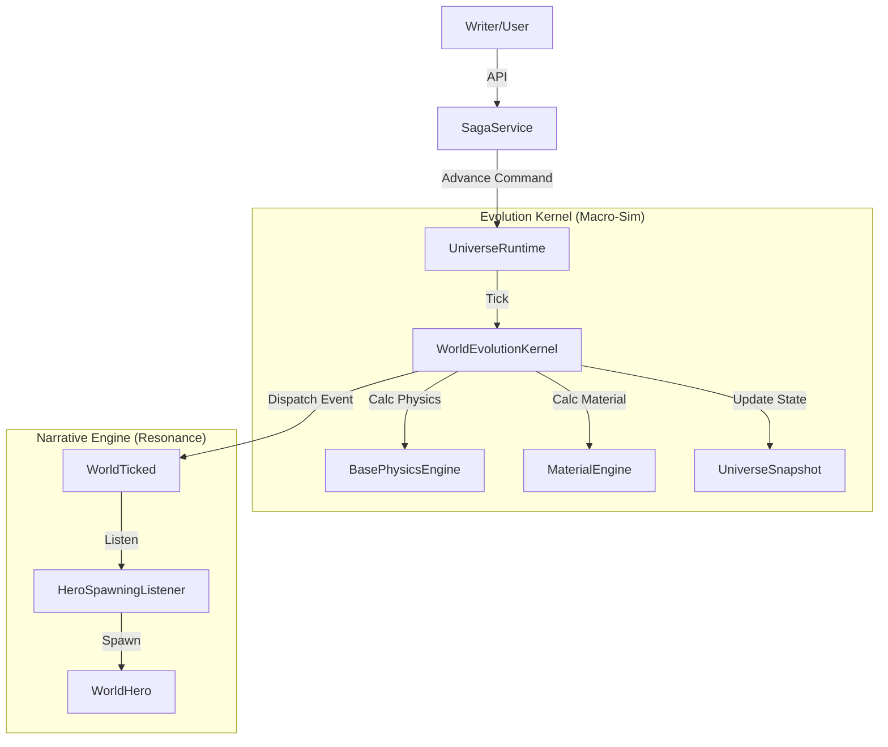

# 01 — WorldOS V3: Architecture Overview

## 1.1 Core Philosophy
WorldOS V3 is an **Event-Driven Macro-Simulation Engine**. It models the rise and fall of civilizations through **Physics** (Entropy, Order) and **Materials** (Ideas, Tech), rather than simulating individual agents (Micro-Sim).

### Key Transitions from V2
- **From Agent-Based to Statistics-Based**: Instead of 1000 agents running pathfinding, we simulate the "Health" of the civilization (Inequality, Innovation, Trauma).
- **From World-Centric to Universe-Centric**: The `World` is just a Blueprint (Genotype). The `Universe` is the living Instance (Phenotype).
- **From Loop-Based to Resonance-Based**: Narrative events (Heroes, Wars) are not random; they are *resonances* triggered by specific Physics states (e.g., High Entropy -> Spawn Rebel).

## 1.2 System Architecture

## 1.3 The Three Pillars

### 1. Physics (The Engine)
Managed by `BasePhysicsEngine`. Calculates:
- **Entropy**: Chaos, waste, decay.
- **Order (Cohesion)**: Stability, unity.
- **Inequality**: Wealth gap (driver of conflict).
- **Innovation**: Tech progress (counter to entropy).

### 2. Materials (The Fuel)
Managed by `MaterialEngine`. Concepts like *Democracy*, *Gunpowder*, *Rice Farming* are "Active Materials" that exert pressure on Physics.
- *Gunpowder* -> Increases Military, Increases Entropy.
- *Confucianism* -> Increases Order, Increases Cohesion.

### 3. Resonance (The Story)
Managed by `Listeners`. When Physics/Material states hit critical thresholds (e.g., "Entropy > 0.8"), the system *resonates* by spawning Narrative Agents (Heroes) or Events, creating the "Story" automatically.
