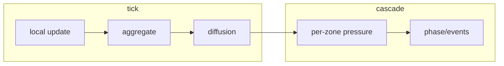
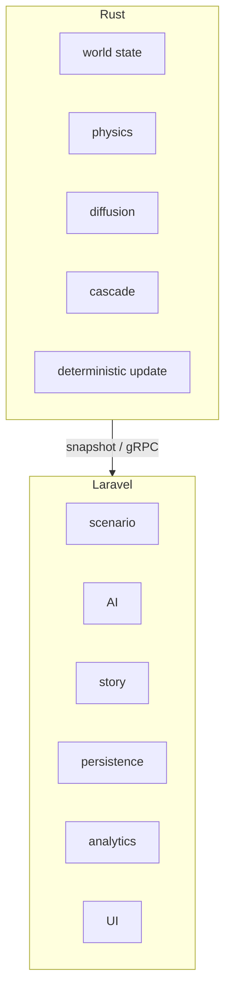
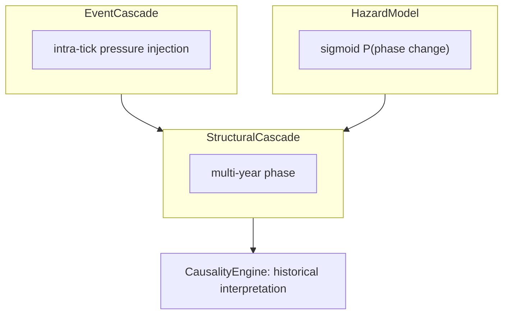

# 21 — Field-Based Simulation Architecture & Upgrade Path

Tài liệu tổng hợp kiến trúc **field-based simulation** của WorldOS (so với event propagation), ưu điểm, thiếu sót, rủi ro và roadmap nâng cấp. Đây là **WorldOS Simulation Architecture Document** — nền tảng cho onboard, refactor và mở rộng nhất quán.

---

## 1. Tổng quan kiến trúc: Field-based vs Event propagation

### Mô hình hiện tại

WorldOS mô hình **fields → pressure → phase change**, không phải **event → event → event**.

- **Các field** dùng trong pressure (xem `engine/worldos-core/src/universe.rs` — `pressure_at_zone()`):
  - `inequality`, `entropy`, `trauma`, `material_stress` với trọng số 0.2, 0.3, 0.2, 0.3.
- **Cascade**: `pressure >= COLLAPSE_THRESHOLD` → phase tiến một bước (Normal → Famine → Riots → Collapse). Code: `engine/worldos-core/src/cascade.rs`.

So sánh ngắn: cách tiếp cận này gần với **macro-societal field** trong computational sociology, complexity science và civilization modeling.

---

## 2. Luồng tick và vai trò của diffusion

Thứ tự trong một tick:

1. **`tick()`** (Rust): local update → aggregate → **diffusion**
2. Sau đó **`cascade()`**: per-zone pressure → phase/events

**Diffusion** (Phase 3 trong `engine/worldos-core/src/universe.rs`): entropy, tech, culture, civ_fields lan giữa **neighbors**; hiện không có population flow.

Hệ quả: cascade **không** lan trực tiếp từ zone A sang zone B qua event chain, mà **gián tiếp** qua state — entropy/stress từ A diffusion sang B, sau đó `pressure_at_zone(B)` tăng và cascade B có thể trigger trong cùng tick.

Mô hình tương tự **reaction–diffusion** trong ecology, epidemiology, urban modeling.

---

## 3. Ưu điểm của cách tiếp cận hiện tại

- **Ổn định**: Tránh event storm (1 famine → 10 migrations → 50 riots…); shock dissipates qua diffusion.
- **Độ phức tạp**: O(n zones); không nổ state space như event propagation với agents rời rạc.
- **Emergent behavior**: Không cần rule tường minh "famine → migration", vẫn có hiệu ứng kiểu migration qua diffusion.

---

## 4. Thiếu sót và thứ tự nâng cấp đề xuất

| Thứ tự | Hạng mục | Mô tả ngắn |
|--------|----------|-------------|
| 1 | **Population flow** | Hiện chỉ diffusion entropy/culture/civ_fields; không có population drop A / rise B. Đề xuất: Population Pressure Diffusion (population_pressure = pop/resources; flow = k×(pressure_A − pressure_B); pop[A]−=flow, pop[B]+=flow). |
| 2 | **Phase-dependent diffusion** | Diffusion coefficient cố định; đề xuất phase cao (Famine/Riots/Collapse) tăng hệ số (vd. Normal 1.0, Famine 1.3, Riots 1.8, Collapse 2.5) để collapse lan nhanh hơn (domino). |
| 3 | **Resource economy & geography** | Thiếu ràng buộc địa lý (terrain, climate, rivers, trade routes); resource economy chưa đủ để "sống". |
| 4 | **Probabilistic cascade** | Cascade hiện deterministic (pressure ≥ threshold → phase++); có thể thêm Hazard model và Event cascade (intra-tick pressure). Chi tiết mục 10. |

Tham chiếu code: `engine/worldos-core/src/universe.rs` (Phase 3, pressure_at_zone), `engine/worldos-core/src/cascade.rs`, [16 Simulation Kernel & Potential Field](16-simulation-kernel-and-potential-field.md) §16.6 population_proxy.

---

## 4b. Ba cơ chế chống entropy explosion và permanent dynamics

Để tránh entropy explosion hoặc stagnation, simulation lớn cần **ba lực đối lập**:

### I. Energy Injection (nguồn biến động bên ngoài)

World cần shock từ ngoài: climate shift, asteroid, volcanic eruption, new technology. Pseudo: `random_zone += shock`. Thiếu → equilibrium tĩnh.

### II. Negative Feedback / Reset

Nếu chỉ có positive feedback (collapse → stress → collapse) → runaway. Cần reset khi collapse: entropy↓, inequality↓, population↓ (ví dụ lịch sử: Black Death → reset economy). Cascade hiện có thể clear materials ở Collapse; cần làm rõ reset dynamics (giảm pressure/entropy sau collapse).

### III. Diversity / Innovation Generator

Diffusion làm mọi zone giống nhau. Cần tạo khác biệt mới: cultural mutation, technology divergence, ideology formation. Pseudo: `culture += random_drift`, `tech_discovery += stochastic`.

**Cycle generator**: Lịch sử có chu kỳ growth → prosperity → inequality → crisis → collapse → reset. Encode dạng growth_engine, inequality_engine, collapse_engine, recovery_engine → **permanent dynamics** thay vì equilibrium.

**Trong WorldOS hiện tại**: Đã có fields, diffusion, cascade; **chưa rõ** energy injection, reset dynamics, innovation generator → rủi ro 1000 ticks → stagnation.

**Controlled randomness**: Random không phải uniform mà **structured stochastic** — ví dụ `P(discovery) = f(population, stability)`, `P(religion emergence) = f(trauma)` → story-like events.

**Test entropy explosion**: Chạy 10.000 ticks, log mean/variance của pressure và entropy. Nếu variance → 0: system đang chết; variance → 1: collapse. **Healthy simulation**: variance oscillates.

**Kiến trúc 5 lớp** (simulator lớn): Physics → Ecology → Population → Society → History; mỗi layer tạo noise, feedback, reset để world luôn dynamic.

**Kết luận**: Để tránh stagnation lâu dài, cần thêm **Innovation Engine**, **Resource Economy**, **Population Flow**, **Climate Dynamics**. WorldOS đã rất gần **Civilization generator** (empire, religion, trade network, war, collapse); cần bổ sung ba cơ chế trên để dynamics bền vững.

---

## 4c. Observability & Metrics

Khi simulation chạy 10.000+ ticks, **phải đo được** để biết world đang sống hay chết:

- **Metrics đề xuất**: mean pressure, variance pressure, collapse rate, population variance, innovation rate (hoặc tương đương theo state hiện có).
- **Ý nghĩa**: variance_pressure → 0 → world stagnation; variance → 1 → collapse. Không có metrics thì không biết simulation đang chết.
- **Đề xuất**: Logging / dashboard các chỉ số trên (per tick hoặc per N ticks); liên hệ với "Test entropy explosion" (mục 4b) — healthy simulation có variance oscillates.

---

## 4e. Healthy simulation band (Deep Sim Phase 2)

Định nghĩa **healthy** để calibration:

- **variance_pressure** không tiến về 0 (stagnation — world "chết") và không bùng nổ liên tục (toàn collapse).
- **collapse_rate** không luôn 0 (quá ổn định, không có crisis) cũng không luôn 1 (sụp đổ toàn bộ).
- **mean_pressure** dao động trong band (ví dụ 0.2–0.7) thay vì dính sát 0 hoặc 1.

**Cách đo**: Chạy `php artisan worldos:simulation-batch --universe=ID --ticks=10000 --chunk=100 --log-every=100 --output=storage/logs/metrics.json`. Đọc file metrics (JSON/CSV): vẽ hoặc in time series `variance_pressure`, `mean_pressure`, `collapse_rate`. Healthy khi variance oscillates (không monotonic → 0 hoặc → 1). Script optional: đọc JSON, in min/max/mean của variance_pressure và collapse_rate để nhanh đánh giá.

---

## 4d. Simulation Replay / Deterministic Debugging

Nếu bug xảy ra ở tick 5234, cần **replay tick 5230 → 5234** để debug. Yêu cầu:

- **Seed** (universe/world) + **snapshot** (state tại tick 5230 hoặc trước đó) + **deterministic kernel** (cùng input → cùng output).
- **Rust kernel** rất phù hợp: tick và cascade deterministic với seed; snapshot đã có (universe_snapshots). Laravel chỉ cần lưu/load snapshot và gọi engine với đúng seed.

**Replay workflow**: Load snapshot tại tick N, set seed, chạy tick N+1..M, so sánh output. Đây là lợi thế của kiến trúc deterministic Rust.

---

## 5. Rủi ro Logic Drift (Rust vs Laravel)

**Vấn đề**: Simulation logic đang split: Rust kernel (physics, cascade, diffusion) + Laravel engine pipeline (Geography, Climate, Agriculture, Population, …). Nếu không kiểm soát → **logic drift**: cùng một quy tắc (vd. population growth) Rust dùng `growth_rate = f(food)` còn Laravel dùng `growth_rate = f(food, religion)` → simulation không còn deterministic.

**Khuyến nghị**: Nguyên tắc **single source of truth** — quy tắc vật lý / state transition **deterministic** nên sống ở một nơi (Rust hoặc Laravel), không duplicate; Laravel chỉ orchestration, narrative, AI, persistence. Tham chiếu config `simulation_tick_driver` (rust_only vs laravel_kernel) và [16 Simulation Kernel & Potential Field](16-simulation-kernel-and-potential-field.md).

---

## 6. Priority System và Phase Groups

**Vấn đề**: Hiện ~25 engines, priority integer (0–24). Integer priority sẽ không scale khi engine > 40 (engine C cần nằm giữa A=10 và B=11 → refactor hàng loạt).

**Khuyến nghị**: Chuyển sang **phase groups** rồi **engine_priority** trong từng phase. Ví dụ nhóm: PHYSICAL, CLIMATE, ECOLOGY, ECONOMY, SOCIAL, POLITICS, CONFLICT, CULTURE, META. Trong mỗi phase dùng priority nhỏ (phase_priority + engine_priority). Pattern này dùng trong **ECS systems** và **game simulation loops**.

Hướng mở rộng: EngineRegistry / contract có thể thêm `phase(): string` và sort theo phase rồi priority.

---

## 7. Laravel Pipeline vs Rust: Phân vai rõ ràng

**Vấn đề**: Laravel kernel tick (container resolve, service provider, event dispatch) chi phí cao; khi scale 10k zones, 100k agents, Laravel tick có thể chậm gấp 100× Rust. Nếu ranh giới không rõ, dev sẽ nhét logic vào Laravel.

**Ranh giới tường minh**:

| Rust responsibilities | Laravel responsibilities |
|------------------------|--------------------------|
| world state | scenario |
| physics | AI |
| diffusion | story |
| cascade | persistence |
| deterministic update | analytics |
| | UI |

Đây đã là **Hybrid Simulation Architecture** phù hợp world/history/civilization generator; cần làm rõ ranh giới để tránh đưa logic nặng vào Laravel pipeline.

---

## 8. Black Swan / Rare Event Engine (thiếu sót quan trọng)

**Vấn đề**: Engine list hiện rất gần civilization stack nhưng thiếu layer tạo **sudden history shocks**. Không có nó simulation dễ thành "smooth evolution"; lịch sử thật thường "90% normal, 10% chaos".

**Ví dụ sự kiện hiếm**: meteor strike, super plague, genius birth, religious prophet, economic crash, volcano winter.

**Deterministic implementation**: Có thể giữ **reproducibility** bằng `event = hash(seed, tick)` — ví dụ `if hash % 10000 == 1` → meteor. Đặt trong Rust kernel với seed từ universe/world.

**Đề xuất**: Black Swan Engine (hoặc Rare Event Generator) — low probability per tick, inject pressure/state shocks; nên deterministic (hash(seed, tick)) để replay được.

---

## 9. Multi-Timescale và Engine Interval

**Vấn đề**: Simulation lớn luôn cần **fast dynamics** và **slow dynamics**. 1 tick = 1 năm nhưng một số quy trình không hợp 1 năm: Disease/Trade có thể theo tháng, Population theo năm, Climate theo thập kỷ, Culture theo thế kỷ. Chạy tất cả cùng tick → simulation **oscillate** (famine → collapse → recovery → famine).

**Ví dụ tham chiếu**: disease: month, trade: month, population: year, climate: decade, culture: century.

**Giải pháp**: **Multi-timescale**: mỗi engine có **interval** = số tick giữa hai lần chạy. Tick loop: `if current_tick % interval === 0` thì `run(engine)`.

**Interface hiện tại**: `SimulationEngine::tickRate()` chính là **interval** (số tick giữa hai lần chạy): `tickRate() === 1` → chạy mỗi tick; `tickRate() === 12` → chạy mỗi 12 tick. SimulationKernel đã gọi engine chỉ khi `(tick % engine->tickRate()) === 0`. Không cần thêm method `interval()` — semantic giống nhau; có thể dùng alias trong doc nếu cần. Hierarchical time (day/month/year/decade/century) khi scale lớn — hướng dài hạn.

---

## 10. Cascade: Structural + Event + Hazard (Dual Cascade và Probabilistic)

### Structural cascade (hiện có)

Multi-year, 1 phase step / year (Normal → Famine → Riots → Collapse). Phù hợp Tainter/Turchin — stress accumulation → resource crisis → unrest → collapse. Ưu điểm: stable, cho engine khác cơ hội phản ứng (trade, governance, religion), history "human scale". Điểm yếu: không mô hình sudden shocks (Black Death, French Revolution trong 1–2 năm).

### Đề xuất Dual Cascade

- **Structural cascade**: giữ như hiện tại (multi-year).
- **Event cascade (shock)**: đồ thị sự kiện trong cùng tick (vd. War → +famine_pressure, Famine → +unrest, Unrest → +revolt_probability) chỉ **cộng pressure**, không trực tiếp đổi phase; structural cascade vẫn quyết định phase change. **Đã triển khai**: khi emit Famine/Riots/Collapse, engine cộng entropy/trauma/inequality cho neighbor zones (constants `EVENT_CASCADE_*`); xem [20](20-rust-engine-material-cascade.md) §20.8.

### Hazard model

Thay vì deterministic `pressure >= threshold → phase++`, dùng **P(phase change) = sigmoid(pressure)** (vd. `p = 1/(1+e^(-k*(pressure - threshold)))`; `if rand() < p then phase++`) → collapse timing unpredictable, history organic hơn.

### Cấu trúc đề xuất

CascadeEngine gồm StructuralCascade + EventCascade + HazardModel. **CausalityEngine** chạy sau cascade → **historical interpretation layer**: simulation tạo famine/riots/collapse, CausalityEngine suy ra narrative ("Grain Crisis triggered fall of Northern Kingdom"). Tham chiếu `engine/worldos-core/src/cascade.rs` và thứ tự engine (CausalityEngine priority 24).

---

## 11. Hướng dài hạn

- **Agent + Field hybrid**: Giữ field layer, thêm actor layer (rulers, armies, traders) → multi-scale civilization simulator.
- **World map**: Zone grid + neighbors đã sẵn; thêm terrain, climate, rivers, trade routes → emergent city formation, empire borders, trade hubs.

---

## 12. Liên kết với tài liệu và code hiện có

- [16 Simulation Kernel & Potential Field (V6)](16-simulation-kernel-and-potential-field.md) — Laravel kernel, Potential Field, population_proxy.
- [20 Rust Engine: Material & Cascade (V6)](20-rust-engine-material-cascade.md) — Rust material system, cascade, diffusion.
- `engine/worldos-core/src/universe.rs` — tick 3 phase, diffusion, pressure_at_zone.
- `engine/worldos-core/src/cascade.rs` — tick_with_cascade, CascadePhase, SimEvent.
- `backend/app/Simulation/EngineRegistry.php` — phase, priority, getOrdered(); `backend/app/Simulation/Contracts/SimulationEngine.php` — interface (phase, priority, tickRate = interval, handle).

---

## 13. Sơ đồ (Mermaid)

### Luồng tick

### Lan truyền cross-zone

### Hybrid Architecture (Rust vs Laravel)

### Dual Cascade (đề xuất)

---

## 14. Giá trị doc và đánh giá dự án

**Giá trị doc**: Nếu doc này hoàn thành tốt, repo sẽ có **WorldOS Simulation Architecture Document** — thứ mà nhiều project simulation không có; giúp onboard, refactor và mở rộng nhất quán.

**Đánh giá mức độ**: Thành thật, sau khi đọc kiến trúc và roadmap, WorldOS hiện nằm khoảng **70–80% của một civilization simulator framework**. Chưa phải game, chưa phải research engine hoàn chỉnh, nhưng nền tảng đã có: field simulation, diffusion, cascade, multi-engine architecture. Nếu thêm **population flow**, **economy**, **innovation**, **geography** thì simulation sẽ bắt đầu **tự sinh lịch sử**.
