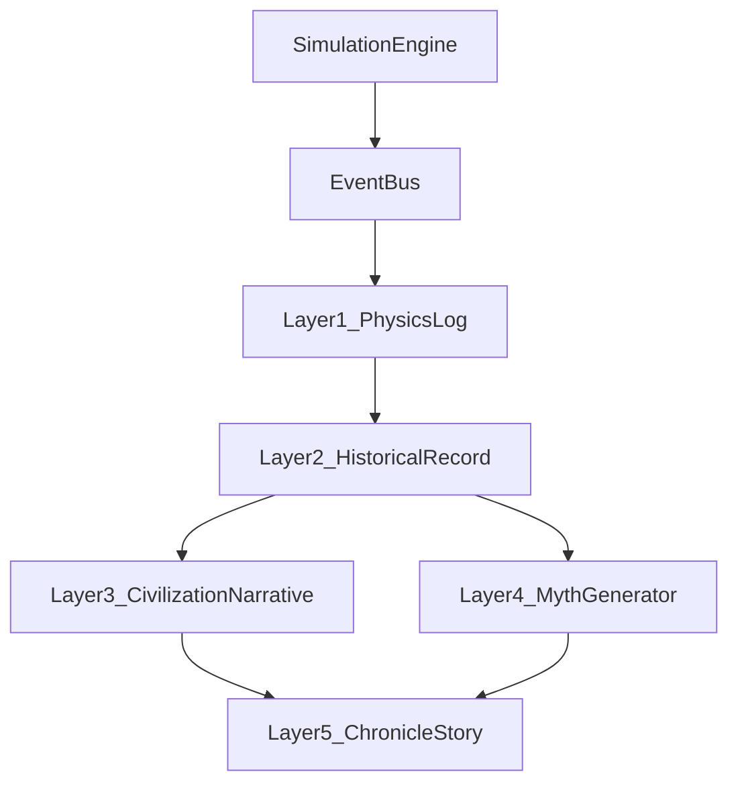

## Narrative Engine v2 — Kiến trúc sử mô phỏng cho WorldOS

### 1. Hiện trạng Narrative Engine v1

#### 1.1 Những gì đã có

Hệ Narrative hiện tại của WorldOS đã có các mảnh ghép quan trọng:

- **Multi narrative types**:
  - **event**: mô tả thay đổi vật lý/hệ thống.
  - **myth**: diễn giải mang tính thần thoại.
  - **narrative**: trạng thái tổng quát của universe.
  - **chronicle**: đoạn văn kể chuyện ở cấp civilization.
- **Myth & Chronicle layer**:
  - `MythicResonanceEngine`, `MythologyGeneratorEngine`, `PerceivedArchiveBuilder`, `NarrativeAiService`, `NarrativeCompiler`, `NarrativeStudioService`.
  - Bảng `chronicles`, `HistoryEngine`, `CivilizationMemoryEngine`.
- **Kết nối LLM & context**:
  - `LlmNarrativeClientInterface`, `OpenAINarrativeService`, `config('worldos.narrative.*')`.
  - `PerceivedArchiveBuilder` + `FlavorTextMapper` + `EventTriggerMapper` + `ResidualInjector`.

#### 1.2 Vấn đề kiến trúc

- **(1) Trùng lặp logic narrative, thiếu event identity**
  - Cùng một event xuất hiện ở nhiều dạng:
    - `event`: “Các hằng số cơ bản của vũ trụ đột ngột biến đổi”.
    - `myth`: “Thiên Đạo vừa điều chỉnh lại các hằng số hằng hữu”.
  - Nhưng **không có `event_id` / WorldEvent** chung.
  - Hệ quả:
    - Khó trace lịch sử.
    - Myth có thể lệch narrative.
    - AI dễ hallucinate, vì mỗi layer nghĩ event là độc lập.

- **(2) Chronicle quá giống novel generator, thiếu Historical Fact**
  - Nhiều chronicle hiện tại giống: “In the urban jungle of Giong Van…”.
  - Định nghĩa đúng cho một simulation‑grade chronicle:
    - **Bước 1 – Historical document (fact‑first)**:
      - Year 312  
        City: Giong Van  
        Population: 1.2M  
        Trade index: +0.34  
        Inequality: 0.71  
        Events:
        - Merchant guild conflict
        - Tax increase
        - Industrial expansion
    - **Bước 2 – Story Generator / Chronicle Engine** dùng block trên để viết story.

- **(3) Thiếu Perspective Layer rõ ràng**
  - Chuỗi perception chuẩn trong một sim lớn:
    - Reality  
      ↓  
      Civilization perception  
      ↓  
      Religion perception  
      ↓  
      Historical record
  - Ví dụ “Asteroid impact” cần đồng thời sinh:
    - **Physics**: `Asteroid collision energy 10^21 J`.
    - **Civilization**: “A catastrophic celestial object struck the land”.
    - **Religion**: “The gods punished the arrogant empire”.
    - **Myth**: “The sky dragon fell from heaven”.

- **(4) Narrative chưa gắn chặt với Actor / Civilization**
  - Lý tưởng: **History = actions of actors**.
  - Thay vì: “The city was full of ambition”,
  - Phải là: `Actor 3912 (Lưu Mạnh) founded Merchant Guild in Giong Van`, với hậu quả rõ ràng:
    - Trade index +0.37.
    - New institution: Merchant Guild.

---

### 2. Mục tiêu Narrative Engine v2

Narrative Engine v2 phải:

- **Biến simulation events thành lịch sử có cấu trúc (Historical Fact)**, không chỉ text.
- **Tạo nhiều góc nhìn (perspective)**: Physics, Civilization, Religion, Myth, Story.
- **Gắn narrative với Actor, Institution, Civilization**:
  - Dựa trên `ActorEvent`, `BranchEvent`, `Institution` events, `UniverseSnapshot.metrics`.
- **Cho phép AI viết story nhưng không phá simulation**:
  - AI chỉ diễn giải/biên tập từ facts, **không sinh event mới**.
- **Tạo mythology / culture evolution**:
  - Legend, Ideology, Philosophy, Cultural Memory dựa trên state, không phải bịa text.

---

### 3. Năm layer Narrative

#### 3.1 Mô hình 5 tầng

- **Layer 1 — Physics Log**
  - Log vật lý/mô phỏng: entropy, stability, collision energy, casualties estimate, resource levels, disaster intensity…
  - Nguồn: `UniverseSnapshot.state_vector` + các engine vật lý/thảm họa.

- **Layer 2 — Historical Record (Historical Fact)**
  - Chuẩn hóa thành bản ghi lịch sử:
    - `event_id`, `tick`/`year`, `location` (zone/city/region), `civilization_id`.
    - `actors_involved[]` (id + role), `institutions_involved[]`.
    - `metrics_before` / `metrics_after` (population, trade_index, inequality, war_pressure…).
    - `event_facts[]` như: `MerchantGuildFounded`, `TaxReformIntroduced`, `CivilWarBegan`…
  - Đây là tầng **“History = actions of actors”**.

- **Layer 3 — Civilization Narrative**
  - Cùng event, góc nhìn civilization:
    - “Giong Van entered a golden age of commerce”.
    - “The merchant class rose as a new elite”.
  - Dùng Fact + trạng thái civ (ideology, power structure, economy).

- **Layer 4 — Myth Generator (Religion / Myth)**
  - Diễn giải thần thoại / tôn giáo:
    - “The fire god awakened beneath the mountain”.
    - “The sky dragon fell from heaven”.
  - Kết nối: trạng thái Religion/Ideology, `MythicResonanceEngine`, `MythScars`.

- **Layer 5 — Chronicle Story (Story Generator)**
  - Từ Fact + Perspective + Actor History → truyện/sử thi cho người đọc:
    - “In the bustling streets of Giong Van, a young merchant named Lưu Mạnh founded a guild that would change the destiny of the city…”.
  - **Bị ràng buộc bởi Layer 1–4 để giảm hallucination.**

#### 3.2 Pipeline (tổng quan)



---

### 4. World Event Model & Event Normalizer

#### 4.1 WorldEvent — trục xoay chung

Để tránh trùng lặp logic, mọi narrative phải quay quanh một **World Event Object** chung (mô tả theo kiểu Rust):

```text
struct WorldEvent {
    id: Uuid,
    tick: u64,
    category: EventCategory,
    actors: Vec<ActorId>,
    location: Option<LocationId>,
    civilization: Option<CivId>,
    physical: PhysicalEvent,      // Layer 1
    facts: Vec<EventFact>,        // Layer 2
    narrative: NarrativeView,     // Layer 3
    myth: MythView,               // Layer 4
    chronicle: ChronicleView,     // Layer 5 (structured)
}
```

Ví dụ: **Cosmic Constant Shift**:

```text
EventID: 8A23
Type: CosmicConstantShift
Tick: 4

physical:
  constants_mutated: true
  entropy_delta: +0.12

facts:
  - "Baseline constants changed beyond threshold X"

narrative:
  "Các hằng số cơ bản của vũ trụ biến đổi"

myth:
  "Thiên Đạo điều chỉnh lại trật tự vũ trụ"

chronicle:
  civilization_views:
    - civ_id: 1
      view: "The age of stable laws ended overnight."
```

#### 4.2 Event Normalizer

**Event Normalizer** nhận raw event từ các engine:

```text
ASTEROID_IMPACT
CITY_TRADE_BOOM
ACTOR_KILLED
CIVILIZATION_COLLAPSE
GUILD_FOUNDED
...
```

và biến chúng thành `WorldEvent`:

- Gắn: `actors[]`, `location`, `civilization`.
- Bổ sung: `PhysicalEvent`, `EventFact[]`.
- Tất cả module narrative/ideology/myth/philosophy đọc từ `WorldEvent`, **không đọc thẳng state rời rạc.**

---

### 5. Chronicle đúng nghĩa Historical Fact

#### 5.1 Chronicle v2

Thay vì chỉ lưu story text, Chronicle v2 có **hai lớp**:

- **Historical Fact Block** (Layer 2):
  ```text
  Tick: 314 (Year 312)
  City: Giong Van
  Civ: GiongVanCityState

  Population: 1.2M → 1.25M
  Trade index: +0.34 → +0.37
  Inequality: 0.71 → 0.69

  Events:
  - Merchant Guild founded (Actor 3912: Lưu Mạnh)
  - Tax reform introduced (Ruler 101)
  - Industrial expansion (Factory cluster in East District)
  ```

- **Chronicle Story (optional)** — sinh bởi Chronicle Generator / AI Historian, luôn tham chiếu lại `event_ids`, actor, metrics đã log.

---

### 6. Perspective Layer

#### 6.1 Chuỗi perception

```text
Reality (Physics & Metrics)
    ↓
Civilization perception (economy, politics, culture)
    ↓
Religion perception (thần học, giáo lý)
    ↓
Myth (hình tượng, thần thoại)
    ↓
Historical record & Story
```

Một event “Asteroid impact”:

- **Physics**: asteroid energy, bán kính ảnh hưởng, casualty estimate.
- **Civilization**: “A catastrophic celestial object struck the land”.
- **Religion**: “The gods punished the arrogant empire”.
- **Myth**: “The sky dragon fell from heaven”.

#### 6.2 Perspective Engine

**Perspective Engine** là module đóng gói layer perception:

- **Đầu vào**:
  - `WorldEvent` + state về civ (ideology, institutions, power structure) + religion/culture.
- **Đầu ra**:
  - `Interpretation` cho từng layer:
    - `physics_view`
    - `civilization_view` (theo civ)
    - `religious_view`
    - `mythic_view`
- Các interpretation này được gắn vào **Narrative Memory Graph** và/hoặc `raw_payload.interpretations` của Chronicle.

---

### 7. Gắn Narrative với Actor — Actor Story Engine

#### 7.1 Nguyên tắc

- **History = actions of actors.**
- Mỗi fact/event quan trọng phải chỉ ra **ai** làm gì, **ở đâu**, hậu quả ra sao.
- Simulation hiện có: `Actor`, `ActorEvent`, `SupremeEntity` (great person), `InstitutionalEntity`, `InstitutionLeader`, `Idea`, `Artifact`…

#### 7.2 Actor Story Engine

**Actor Story Engine** gom:

- `ActorEvent` timeline.
- `WorldEvent` nơi actor tham gia (`INVOLVED_IN`).
- `Institution` / `Idea` / `Artifact` mà actor sáng lập/ảnh hưởng.

Để build ví dụ **Actor: Lưu Mạnh (id = 3912)**:

```text
Birth: Tick 120 (City: Giong Van)
Occupation: Merchant
Wealth: High
Traits: high ambition, high charisma

Major Events:
- Tick 284: Led trade coalition
- Tick 314: Founded Merchant Guild
- Tick 321: Influenced tax reform
- Tick 330: Rivalry with Thương Nhân Guild, sparked Merchant Revolt

Impact:
- Raised trade index by +0.2 over 10 years
- Shifted power from nobility to merchants
- Seeded “Merchantism” ideology
```

AI (Chronicle/Legend/Philosophy) dùng Actor Story này thay vì bịa thêm nhân vật.

---

### 8. Narrative Memory Graph

#### 8.1 Mục đích

Xây một graph **“bộ não lịch sử”**:

- Trung tâm: **Event**.
- Xung quanh: **Actors**, **Locations**, **Institutions**, **Ideas**, **Legends**, **Myths**, **Chronicles**.

#### 8.2 Node & Edge

- **Nodes**:
  - `EventNode`, `ActorNode`, `LocationNode`, `InstitutionNode`, `IdeaNode`, `PhilosophyNode`, `LegendNode`, `ChronicleNode`.
- **Edges** (ví dụ):
  - `ACTOR_INVOLVED_IN(ActorNode -> EventNode)`.
  - `OCCURS_IN(EventNode -> LocationNode)`.
  - `LED_BY(ActorNode -> InstitutionNode)`.
  - `CAUSES(EventNode -> EventNode)`.
  - `INTERPRETED_AS(EventNode -> ConceptNode, perspective)`.
  - `REMEMBERED_AS(EventNode -> ChronicleNode/LegendNode)`.

Ví dụ “Merchant Revolt”:

```text
Event: Merchant Revolt
Actors:
  - Lưu Mạnh
  - Thương Nhân Guild
Impact:
  - Trade collapse
  - Political reform
```

Trên graph, sự kiện này nối:

- Actors → `ACTOR_INVOLVED_IN` → Event.
- Event → `OCCURS_IN` → City(Giong Van).
- Event → `CAUSES` → TradeCollapse, PoliticalReform.
- Event → `INTERPRETED_AS` → concept “Rise of merchant class” / myth “Gold Serpent of Trade awakened”.

---

## 10. Triển khai backend (đã làm)

- **Event Normalizer**: `App\Modules\Simulation\Services\EventNormalizer` — `buildTickSummaryEvent()`, `emitTickSummaryEvent()`.
- **Historical Fact**: bảng `historical_facts`, model `HistoricalFact`, `App\Services\Narrative\HistoricalFactEngine::record(WorldEvent, UniverseSnapshot)`.
- **Chronicle v2**: `EvaluateSimulationResult::createNarrativeChronicle()` dùng fact + `historical_block` + `NarrativeCompiler`; Chronicle có `world_event_id`, `raw_payload.historical_block`, `raw_payload.interpretations`.
- **Perspective Engine**: `App\Services\Narrative\PerspectiveEngine::interpret()`, `EventInterpretation` (physics / civilization / religion / myth).
- **Actor Story Engine**: `App\Services\Narrative\ActorStoryEngine::buildLifeHistory()`, `getMajorEvents()`.
- **Narrative Memory Graph**: bảng `narrative_nodes`, `narrative_edges`; `App\Services\Narrative\NarrativeMemoryGraphService` (`ensureNode`, `addEdge`, `linkChronicleToFact`, `getSubgraphForEvent`, `getSubgraphForActor`, `getCausalChain`).
- **AI Historian**: `App\Services\Narrative\HistorianAgentService::generateHistory(Universe, outputType, criteria)` — on‑demand, **không** chạy trong pulse.

**Cấu hình** (`config/worldos.php` → `narrative_v2`):

- `enable_world_event`, `enable_fact_first_chronicle`, `enable_perspective_layer`, `enable_memory_graph`, `enable_historian_agent` (mặc định `true`) — có thể tắt từng phần để chạy hybrid v1/v2.

**API**:

- `POST /api/worldos/universes/{id}/historian/generate`  
  - Body: `output_type` (`history_volume` \| `historian_essay` \| `philosophy_treatise`), `from_tick`, `to_tick`, `theme`, `actor_id` (optional).

**Lệnh CLI**:

- `php artisan worldos:historian-generate {universe_id} --type=history_volume --from=0 --to=100 --theme=general --actor=123`.